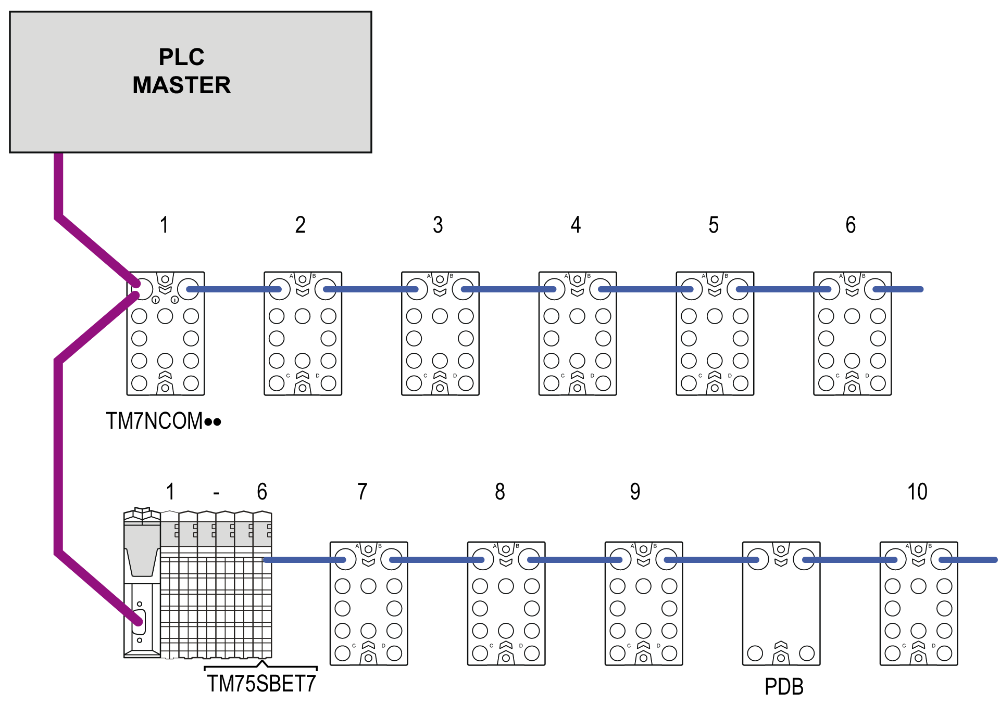

# Addressing

Addressing

Addressing Principle

The TM7 bus is auto-addressing, and automatically increments by 1 starting with the first I/O block after the TM5SBET7 transmitter module. For example, if the address of the transmitter module is 6, the first TM7 I/O block will automatically be assigned an address of 7.

NOTE: The TM7 Power Distribution Block (PDB) does not have a physical address.

An Example of Addressing

The example below illustrates the addressing principle for the TM7 bus. As you can see, the TM7 System automatically addresses the I/O blocks from left to right:

TM7NCOM••   TM7 Field bus interface I/O block

TM5SBET7   Transmitter module

PDB   Power Distribution Block

EIO0000003161.01

© 2020 Schneider Electric. All rights reserved.