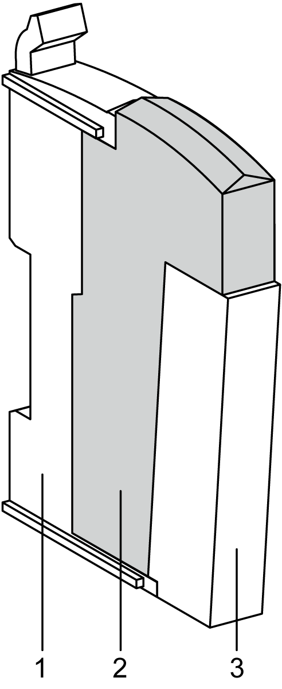

# TM5SPS2F Presentation

TM5SPS2F Presentation

Main Characteristics

The TM5SPS2F Power Distribution Module feeds the TM5 power bus as well as the 24 Vdc I/O power segment through an integrated exchangeable fuse.

The table below describes the main characteristics of the TM5SPS2F electronic module:

| Main Characteristics | |
| --- | --- |
| Maximum current provided on 24 Vdc I/O power segment | 6300 mA |
| TM5 power bus current generated | 1136 mA |

Ordering Information

The following figure and table gives the references to create a slice with the TM5SPS2F electronic module:

| Number | Model Number | Description | Color |
| --- | --- | --- | --- |
| 1 | TM5ACBM01R  or  TM5ACBM05R | Bus base 24 Vdc I/O power segment left isolated    Bus base 24 Vdc I/O power segment left isolated with address setting | Gray    Gray |
| 2 | TM5SPS2F | Electronic module | Gray |
| 3 | TM5ACTB12PS | Terminal block, 12-pin | Gray |

NOTE: For more information, refer to [TM5 Bus Bases and Terminal Blocks](../TM5_Bus_bases_and_Terminal_blocks/TM5_Bus_bases_and_Terminal_blocks-1.htm#XREF_D_SE_0004365_1).

Status LEDs

The following figure shows the TM5SPS2F status LEDs:

The table below describes the TM5SPS2F status LEDs:

| LED | Color | Status | Description |
| --- | --- | --- | --- |
| r | Green | Off | Power supply not connected |
| Single flash | Reset state |
| Flashing | Preoperational state |
| On | RUN state |
| e | Red | Off | OK or module not connected |
| Double flash | Indicates one of the following conditions:  oTM5 power bus is overloaded.  o24 Vdc I/O power segment, via the external power supply or supplies, is too low.  oInput voltage for TM5 power bus, via the external power supply or supplies, is too low. |
| e+r | Steady red/single green flash | | Invalid firmware |
| l | Red | Off | TM5 power bus in the acceptable range |
| On | TM5 power bus is overloaded |

EIO0000003161.01

© 2020 Schneider Electric. All rights reserved.