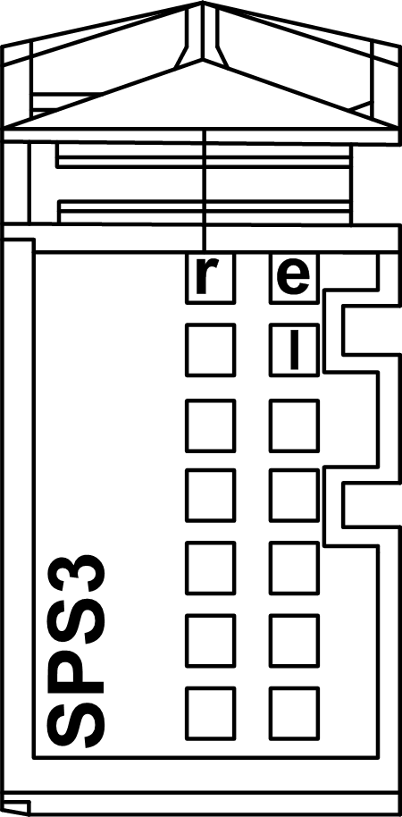

# TM5SPS3 Presentation

TM5SPS3 Presentation

Main Characteristics

The TM5SPS3 Interface Power Distribution Module (IPDM) consists of two dedicated electrical circuits:

oa 24 Vdc main power that serves the electronics of the field bus Interface module and generates independent power for the TM5 power bus that serves the expansion modules.

oa 24 Vdc I/O power segment that serves:

- the expansion modules,

- the sensors and actuators connected to the expansion modules,

- the external devices connected to the Common Distribution Modules (CDM)

The table below provides the main characteristics of the TM5SPS3 :

| Main Characteristics | |
| --- | --- |
| Maximum current provided on 24 Vdc I/O power segment | 10000 mA |
| TM5 power bus generated | 750 mA |

Ordering Information

The following figure and table provide the references to create a TM5 field bus interface with the TM5SPS3:

| Number | Reference | Description | Color |
| --- | --- | --- | --- |
| 1 | TM5ACBN1 | [Bus base for field bus interface module and Interface Power Distribution Module](../SPIG_TM5_TM7_-_Basics_of_the_TM5_System/SPIG_TM5_TM7_-_Basics_of_the_TM5_System-3.htm#XREF_D_SE_0015378_5) | White |
| 2 | TM5NS31 | Sercos [Bus Interface module](../SPIG_TM5_TM7_-_Basics_of_the_TM5_System/SPIG_TM5_TM7_-_Basics_of_the_TM5_System-3.htm#XREF_D_SE_0015378_9) | White |
| TM5NCO1 | [CANopen interface module](../SPIG_TM5_TM7_-_Basics_of_the_TM5_System/SPIG_TM5_TM7_-_Basics_of_the_TM5_System-3.htm#XREF_D_SE_0015378_9) | White |
| TM5NEIP1 | [EtherNet/IP interface](../SPIG_TM5_TM7_-_Basics_of_the_TM5_System/SPIG_TM5_TM7_-_Basics_of_the_TM5_System-3.htm#XREF_D_SE_0015378_9) | White |
| 3 | TM5SPS3 | [Interface Power Distribution Module (IPDM)](../SPIG_TM5_TM7_-_Basics_of_the_TM5_System/SPIG_TM5_TM7_-_Basics_of_the_TM5_System-3.htm#XREF_D_SE_0015378_6) | Grey |
| 4 | TM5ACTB12PS | [Terminal block for PDM, IPDM and receiver electronic module](../SPIG_TM5_TM7_-_Basics_of_the_TM5_System/SPIG_TM5_TM7_-_Basics_of_the_TM5_System-3.htm#XREF_D_SE_0015378_8) | Grey |

NOTE: For more information, refer to [TM5 Bus Bases and Terminal Blocks](../TM5_Bus_bases_and_Terminal_blocks/TM5_Bus_bases_and_Terminal_blocks-1.htm#XREF_D_SE_0004365_1).

Status LEDs

The following figure and table provide the TM5SPS3 IPDM status LEDs:

| LED | Color | Status | Description |
| --- | --- | --- | --- |
| r | Green | Off | Power supply not connected |
| Single flash | Reset status |
| Flashing | TM5 expansion bus in preoperational status |
| On | RUN status |
| e | Red | Off | OK or module not connected |
| Double flash | Indicates one of the following conditions:  o24 Vdc I/O power segment, via the external power supply or supplies, is too low.  oTM5 power bus, via the external power supply or supplies, is too low. |
| e+r | Steady red/single green flash | | Invalid firmware |
| l | Red | Off | The TM5 interface power distribution module supply is within the acceptable range. |
| On | The TM5 interface power distribution module supply is insufficient. |

EIO0000003161.01

© 2020 Schneider Electric. All rights reserved.