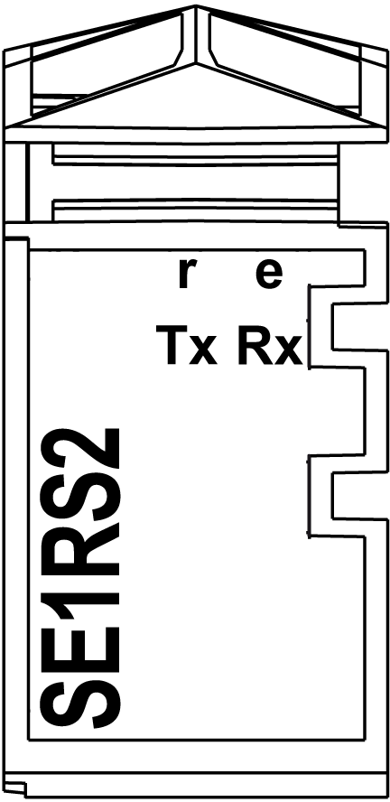

# TM5SE1RS2 Presentation

TM5SE1RS2 Presentation

Main Characteristics

The following table describes the main characteristics of the TM5SE1RS2 electronic module:

| Main Characteristics | |
| --- | --- |
| Function | Communication module |
| Interface | 1 RS-232 interface for serial, remote connection of complex devices to the TM5 System |
| Maximum transfer rate | 115.2 kBit/s |

For compatibility information, refer to Compatibility and Migration User Guide.

Ordering Information

The following illustration shows the TM5SE1RS2 electronic module in combination with the required accessories that require a spacing of 12.5 mm (+ 0.2 mm) (0.49 in. (+ 0.2 in.)).

|  |
| --- |
| NOTICE |
| ELECTROSTATIC DISCHARGE |
| oInstall a right bus base locking plate to the rightmost slice of all configurations.  oInstall a left bus base locking plate to the first slice of all remote configurations. |
| Failure to follow these instructions can result in equipment damage. |

The following table shows the reference for the electronic module:

| Number | Reference | Description | Color |
| --- | --- | --- | --- |
| 2 | TM5SE1RS2 | Electronic module | White |

The following table shows the references for required accessories:

| Number | Reference | Description | Color |
| --- | --- | --- | --- |
| 1 | TM5ACBM11 | TM5 bus module | White |
| 3 | TM5ACTB06  or  TM5ACTB12 | TM5 terminal block, 6 pins    TM5 terminal block, 12 pins | White    White |

NOTE: Order these accessories separately.

NOTE: For more information, refer to [TM5 bus bases and terminal blocks](../TM5_Bus_bases_and_Terminal_blocks/TM5_Bus_bases_and_Terminal_blocks-1.htm#XREF_D_SE_0004365_1).

Status LEDs

The following illustration shows the status LEDs for TM5SE1RS2:

The following table shows the TM5SE1RS2 status LEDs:

| LED | Color | Status | Description |
| --- | --- | --- | --- |
| r | Green | Off | Module supply not connected. |
| Single flash | Reset mode |
| Flashing | Preoperational mode |
| On | RUN mode |
| e | Red | Off | Module supply not connected or OK. |
| On | Detected error or reset state |
| e+r | Steady red / single green flash | | Invalid firmware |
| Tx | Yellow | On | The module is sending data by means of the RS-232 interface. |
| Rx | Yellow | On | The module is receiving data by means of the RS-232 interface. |

EIO0000003161.01

© 2020 Schneider Electric. All rights reserved.