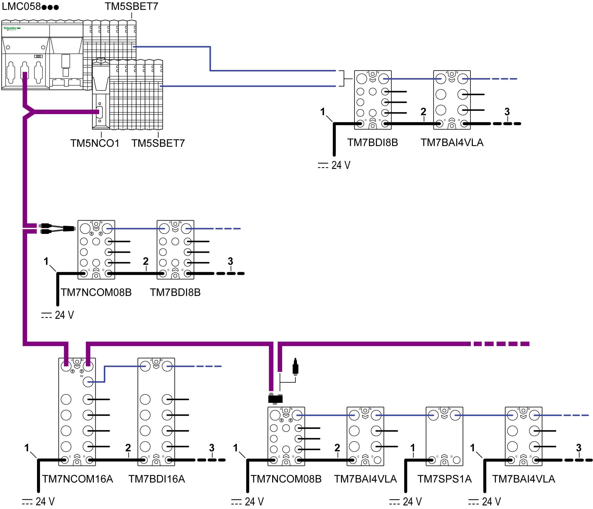

# Power Cables

Power Cables

Overview

The following figure shows the power cables used in TM5/TM7 configurations:

1   Attachment IN cable: to connect an external power supply to a TM7 interface I/O block, a TM7 Power Distribution Block (PDB) or a TM7 I/O block.

2   Drop cable: to route 24 Vdc I/O power segment between two TM7 blocks.

3   Attachment OUT cable: to connect a TM7 block to another device.

Ordering Information

| Length | Short Description, Reference | | | | | |
| --- | --- | --- | --- | --- | --- | --- |
| Drop Cable | | Attachment IN Cable | | Attachment OUT Cable | |
| 0.3 m (1 ft) | TCSXCNEMEF03V | TCSXCNDMDF03V | – | – | – | – |
| 1 m (3.3 ft) | TCSXCNEMEF1V | TCSXCNDMDF1V | TCSXCNEFNX1V | TCSXCNDFNX1V | TCSXCNEXNX1V | TCSXCNDMNX1V |
| 2 m (6.6 ft) | TCSXCNEMEF2V | TCSXCNDMDF2V | – | – | – | – |
| 3 m (9.8 ft) | – | – | TCSXCNEFNX3V | TCSXCNDFNX3V | TCSXCNEXNX3V | TCSXCNDMNX3V |
| 5 m (16.4 ft) | TCSXCNEMEF5V | TCSXCNDMDF5V | – | – | – | – |
| 10 m (32.8 ft) | TCSXCNEMEF10V | TCSXCNDMDF10V | TCSXCNEFNX10V | TCSXCNDFNX10V | TCSXCNEXNX10V | TCSXCNDMNX10V |
| 15 m (49.2 ft) | TCSXCNEMEF15V | TCSXCNDMDF15V | – | – | – | – |
| 25 m (82 ft) | – | – | TCSXCNEFNX25V | TCSXCNDFNX25V | TCSXCNEXNX25V | TCSXCNDMNX25V |
| Dimensions and Pin Assignment | [TCSXCNEMEF••V](#XREF_D_SE_0009908_5)  G-SE-0007399.1.gif | [TCSXCNDMDF••V](#XREF_D_SE_0009908_6)  G-SE-0007400.1.gif | [TCSXCNEFNX••V](#XREF_D_SE_0009908_8)  G-SE-0007401.1.gif | [TCSXCNDFNX••V](#XREF_D_SE_0009908_9)  G-SE-0007402.1.gif | [TCSXCNEXNX••V](#XREF_D_SE_0009908_10)  G-SE-0007403.1.gif | [TCSXCNDMNX••V](#XREF_D_SE_0009908_11)  G-SE-0007404.1.gif |

Cable Characteristics

The table below describes the characteristics of the individual wire of the cable:

| Characteristics | Specifications |
| --- | --- |
| Conductor cross section (gauge) | 0.34 mm2 (AWG 22) |
| Material insulation | Polypropylene (PP) |
| Core diameter including insulation | 1.27 mm (0.05 in.) ± 0.02 mm (0.0008 in.) |
| Electrical resistance (at 20 °C (68 °F) ) | ≤ 0.058 Ω/m (0.018 Ω/ft) |
| Insulation resistance (at 20 °C (68 °F)) | ≥ 100 MΩ\*km (328 GΩ/ft) |
| Nominal voltage | 300 V |
| Test voltage conductor | 3000 Vdc x 1 s |

The table below describes the general characteristics of the cable:

| Characteristics | | Specification |
| --- | --- | --- |
| Cable type | | PUR halogen-free black |
| Conductor material | | Bare Cu litz wires |
| Shield | | Braided copper wires |
| External cable diameter | | 4.7 mm (0.19 in.) |
| Minimum curve radius | | 47 mm (1.85 in.) |
| Wire colors | | Black, brown, blue, white |
| External sheath, color | | Black-gray RAL 7021 |
| Cable weight | | 30 kg/km (0.02 lb/ft) |
| Number of bending cycles | | 4 million |
| Traversing path | | 10 m (32.8 ft) |
| Traversing rate | | 3 m/s (9.8 ft/s) |
| Acceleration | | 10 m/s2 (32.8 ft/s2) |
| M8 fastening torque | | Maximum 0.2 Nm (1.8 lbf-in) |

The table below describes the environmental characteristics of the cable:

| Characteristics | Specification |
| --- | --- |
| Operating temperature | –5...80 °C (23...176 °F) |
| Storage temperature | –40...80 °C (–40...176 °F) |
| Special properties | Flexible cable conduit capable |
| Silicone-free |
| Free of substances which would hinder coating with paint or varnish |
| Flame resistance | As per UL-Style 20549 |
| Freedom from halogen | As per DIN VDE 0472 part 815 |
| Resistance to oil | Complying with DIN EN 60811-2-1 |
| Other resistance | Resistant to acids, alkaline solutions and solvents |
| Hydrolysis and microbe resistant |
| WEEE/RoHS | Compliant |

TCSXCNEMEF••V Dimensions and Pin Assignment

| Dimensions | | | | |
| --- | --- | --- | --- | --- |
| G-SE-0007889.1.gif | | | | |
| L   length as a function of the particular reference | | | | |

| Pin Assignment | | | | |
| --- | --- | --- | --- | --- |
| Male Connector | Pin | Designation | Wire Color | Female Connector |
| G-SE-0007884.1.gif | 1 | 24 Vdc | White | G-SE-0007883.1.gif |
| 2 | 24 Vdc | Brown |
| 3 | 0 Vdc | Blue |
| 4 | 0 Vdc | Black |

TCSXCNDMDF••V Dimensions and Pin Assignment

| Dimensions | | | | |
| --- | --- | --- | --- | --- |
| G-SE-0007882.1.gif | | | | |
| L   length as a function of the particular reference | | | | |

| Pin Assignment | | | | |
| --- | --- | --- | --- | --- |
| Male Connector | Pin | Designation | Wire Color | Female Connector |
| G-SE-0007884.1.gif | 1 | 24 Vdc | White | G-SE-0007883.1.gif |
| 2 | 24 Vdc | Brown |
| 3 | 0 Vdc | Blue |
| 4 | 0 Vdc | Black |

TCSXCNEFNX••V Dimensions and Pin Assignment

| Dimensions | | | | |
| --- | --- | --- | --- | --- |
| G-SE-0007885.1.gif | | | | |
| L   length as a function of the particular reference | | | | |

| Pin Assignment | | | | |
| --- | --- | --- | --- | --- |
| Female Connector | Pin | Designation | Wire Color | Open |
| G-SE-0007883.1.gif | 1 | 24 Vdc | White | For custom wiring |
| 2 | 24 Vdc | Brown |
| 3 | 0 Vdc | Blue |
| 4 | 0 Vdc | Black |

TCSXCNDFNX••V Dimensions and Pin Assignment

| Dimensions | | | | |
| --- | --- | --- | --- | --- |
| G-SE-0007886.1.gif | | | | |
| L   length as a function of the particular reference | | | | |

| Pin Assignment | | | | |
| --- | --- | --- | --- | --- |
| Female Connector | Pin | Designation | Wire Color | Open |
| G-SE-0007883.1.gif | 1 | 24 Vdc | White | For custom wiring |
| 2 | 24 Vdc | Brown |
| 3 | 0 Vdc | Blue |
| 4 | 0 Vdc | Black |

TCSXCNEXNX••V Dimensions and Pin Assignment

| Dimensions | | | | |
| --- | --- | --- | --- | --- |
| G-SE-0007887.1.gif | | | | |
| L   length as a function of the particular reference | | | | |

| Pin Assignment | | | | |
| --- | --- | --- | --- | --- |
| Male Connector | Pin | Designation | Wire Color | Open |
| G-SE-0007884.1.gif | 1 | 24 Vdc | White | For custom wiring |
| 2 | 24 Vdc | Brown |
| 3 | 0 Vdc | Blue |
| 4 | 0 Vdc | Black |

TCSXCNDMNX••V Dimensions and Pin Assignment

| Dimensions | | | | |
| --- | --- | --- | --- | --- |
| G-SE-0007888.1.gif | | | | |
| L   length as a function of the particular reference | | | | |

| Pin Assignment | | | | |
| --- | --- | --- | --- | --- |
| Male Connector | Pin | Designation | Wire Color | Open |
| G-SE-0007884.1.gif | 1 | 24 Vdc | White | For custom wiring |
| 2 | 24 Vdc | Brown |
| 3 | 0 Vdc | Blue |
| 4 | 0 Vdc | Black |

EIO0000003161.01

© 2020 Schneider Electric. All rights reserved.