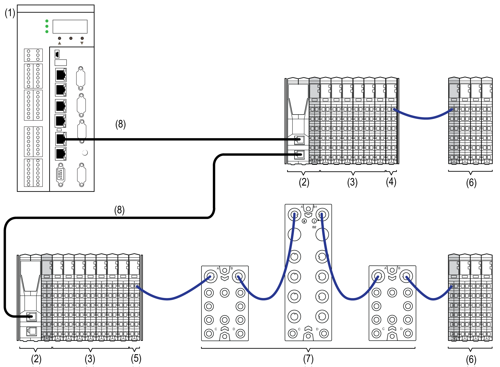

# TM5 / TM7 System I/O Architecture

## Introduction

The TM5 / TM7 System is an open system and can operate with Pacdrive via Sercos III automation bus.

## TM5 / TM7 System I/Os

The following figure represents TM5 / TM7 System I/Os connected via Sercos III bus to a Logic Motion Controller (1):

**1** PacDrive LMC Eco / PacDrive LMC Pro/Pro2

**2** Sercos III Bus Interface TM5NS31

**3** TM5 System I/O Modules

**4** Transmitter Module TM5SBET1

**5** Transmitter Module TM5SBET7

**6** Receiver Module TM5SBER2 and TM5 System I/O Modules

**7** TM7 System I/O Modules

**8** Sercos III Ethernet Bus Cable

## Remote Configuration Architecture

In addition to your distributed configuration you can place remote I/Os at a distance up to 100 m (328.1 ft) from the Sercos III Bus Interface.

NOTE: You can create remote I/Os with TM5 expansion modules and/or TM7 expansion blocks.

Refer to [*Modicon TM5 Transmitter and Receiver Modules Hardware Guide*](../../../../../api/crossBook?lang=en-US&virtualBookName=tm5bushw&topicID=D_SE_0003232) to design remote configurations.

EIO0000001058.04

© 2020

Schneider Electric.

All rights reserved.