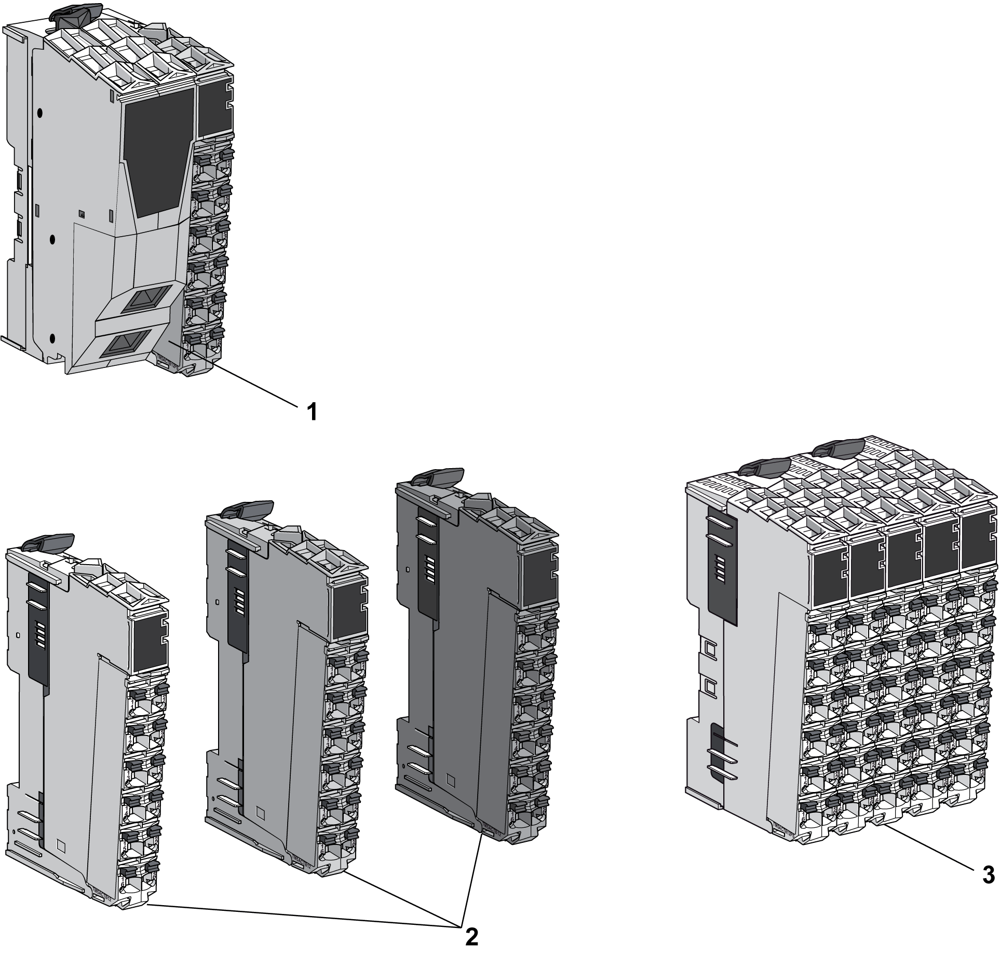

# Color Coding of the TM5 System

## Overview

The following figure shows colors of the TM5 components:

**1** Sercos III Bus Interface TM5NS31

**2** TM5 System I/O Modules

**3** TM5 System Compact I/O Modules

## Sercos III Bus Interface Color Assignment

Two colors are used for the four components of a [Sercos III Bus Interface](D-SE-0015378.html#D-SE-0015378__D-SE-0015378.5):

* White for the:

  + Sercos III Bus Interface bus base and,
  + Sercos III Bus Interface module.
* Gray for the:

  + Interface Power Distribution Module (IPDM) and,
  + associated terminal block.

## Slice Color Assignment

For modules other than the Compact I/O, an assembled TM5 module (referred to as a slice) is composed of a bus base, an electronic module, and a terminal block. Each [slice](D-SE-0015379.html#D-SE-0015379) of the TM5 System is color coded for improved identification.

Different colors are used for the modules:

* White
* Gray
* Black
* Red

NOTE: For more information on red slices for TM5 Safety-Related systems, refer to the specific guide: [*PacDrive TM5 / TM7 Safety Flexible System, System Planning and Installation Guide*](../../../../../api/crossBook?lang=en-US&virtualBookName=pacdpigs&topicID=D_SE_0017150).

The color of a slice is defined by a combination of:

* Input or output voltage,
* Functionality.

The following table gives the colors of the different types of slices:

| Voltage | Functionality | White | Gray | Black |
| --- | --- | --- | --- | --- |
| 24 Vdc | I/Os | X | – | – |
| Power distribution | – | X | – |
| TM5 bus transmission | X | – | – |
| TM5 bus reception | – | X | – |
| 100...240 Vac | I/Os | – | – | X |
| 24 Vdc / 230 Vac | Relay | – | – | X |

| DANGER | |
| --- | --- |
|  | INCOMPATIBLE COMPONENTS CAUSE ELECTRIC SHOCK OR ARC FLASH  * Do not associate components of a slice that have different colors. * Always confirm the compatibility of slice components and modules before installation using the association table in this manual. * Verify that correct terminal blocks (minimally, matching colors and correct number of terminals) are installed on the appropriate electronic modules.  Failure to follow these instructions will result in death or serious injury. |

NOTE: Verify the compatibility of components with the [association table](D-SE-0015409.html#D-SE-0015409) before installation.

## Compact I/O Color Assignment

The color of the compact I/O and their removable terminal blocks is white.

EIO0000001058.04

© 2020

Schneider Electric.

All rights reserved.