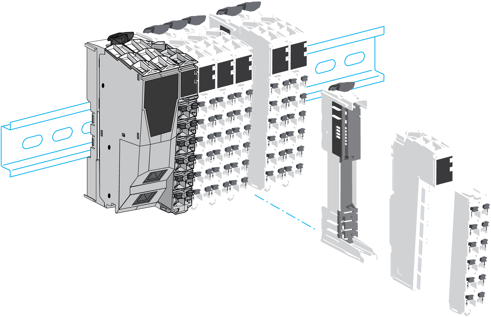
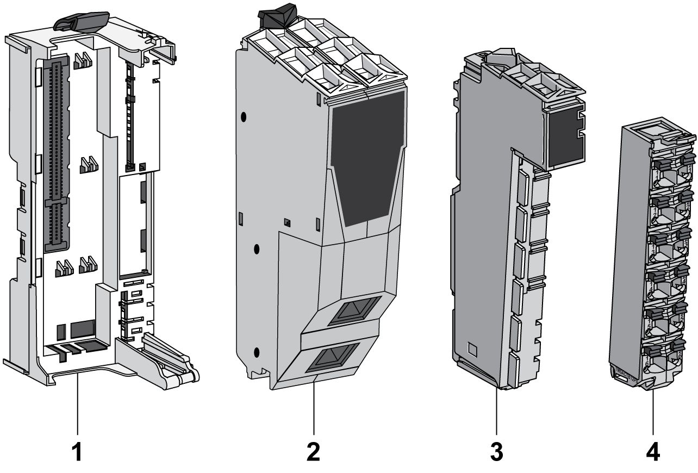
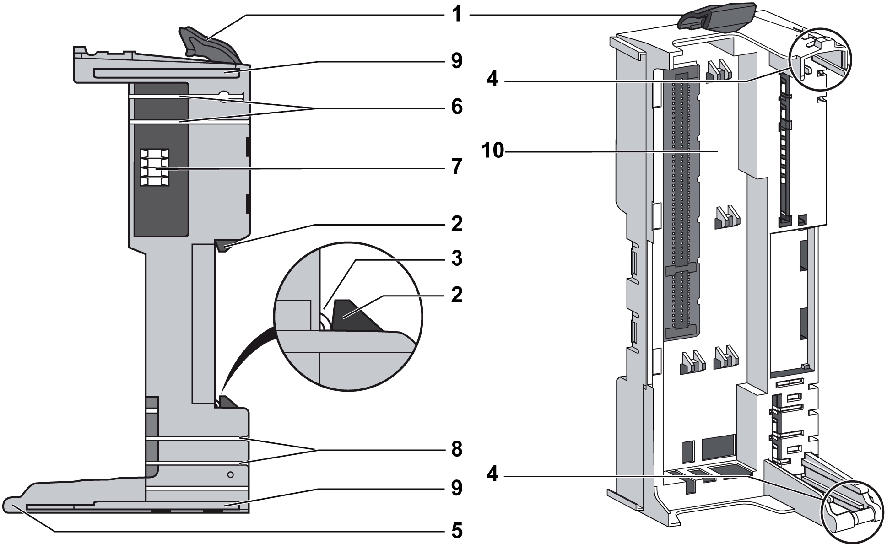
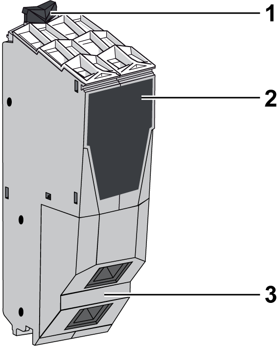
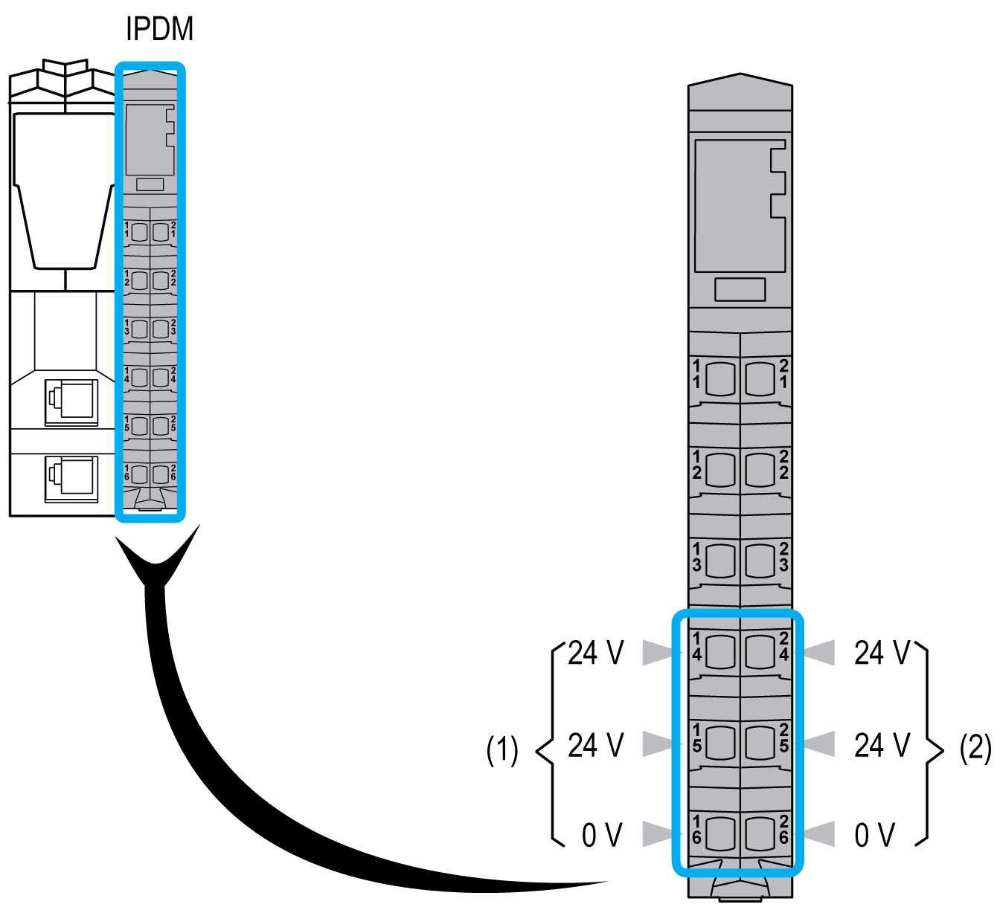

# Sercos III Bus Interface Description

## Introduction

The TM5 Sercos III Bus Interface is the first element of the [TM5 distributed I/O island](D-SE-0015375.html#D-SE-0015375).

The following figure shows the location of the TM5 Sercos III Bus Interface in a distributed I/O island:

## Sercos III Bus Interface Overview

The TM5 Sercos III Bus Interface with built-in power distribution is composed of four different parts that can either be ordered together as a kit, or can be ordered separately as shown below:

| Item | Description |
| --- | --- |
| 1 | Sercos III Bus Interface [bus base](#D-SE-0015378__D-SE-0015378.5) |
| 2 | [Sercos III Bus Interface](#D-SE-0015378__D-SE-0015378.7) |
| 3 | Interface Power Distribution Module [(IPDM)](#D-SE-0015378__D-SE-0015378.6) |
| 4 | [Terminal block](#D-SE-0015378__D-SE-0015378.8) |

## Sercos III Bus Interface Bus Base Description

The following figure shows the different parts of the Sercos III Bus Interface bus base:

**1** Locking lever

**2** DIN rail locking mechanism

**3** DIN rail contact

**4** Guides for assembly of the IPDM

**5** Rotation axle for terminal block

**6** TM5 bus power contacts

**7** TM5 bus data contacts

**8** 24 Vdc I/O power segment contacts

**9** Interlocking guides

**10** Slot for bus interface module

The following table gives the available reference:

| Reference | Sercos III Bus Interface Bus Base Description | Color |
| --- | --- | --- |
| TM5ACBN1 | Bus base for Sercos III Bus Interface module and Interface Power Distribution Module [(IPDM)](#D-SE-0015378__D-SE-0015378.6) | White |

## Sercos III Bus Interface Module Description

The following figure shows the front view of the Sercos III Bus Interface module:

**1** Locking clip

**2** Front view

**3** Bus connector

The following table gives the available reference:

| Reference | Bus Interface Module Description | Color |
| --- | --- | --- |
| TM5NS31 | Sercos III Bus Interface module | White |

## Interface Power Distribution Module (IPDM)

The following table gives the available reference:

| Reference | [IPDM Description](D-SE-0015379.html#D-SE-0015379__D-SE-0015379.6) | Color |
| --- | --- | --- |
| TM5SPS3 | Bus interface 24 Vdc power supply | Gray |

The distribution of the power by the IPDM consists of two dedicated electrical circuits:

| Designation: | Description: |
| --- | --- |
| 24 Vdc Main power | 24 Vdc power that serves the electronics of the bus Interface Module and generates independent power for the TM5 power bus that serves the expansion modules. |
| 24 Vdc I/O power segment | The 24 Vdc power that serves:   * the expansion modules, * the sensors and actuators connected to the expansion modules, * the external devices connected to the Common Distribution Modules (CDM). |

## Terminal Block Description

The following table gives the available reference:

| Reference | [Terminal Block Description](D-SE-0015379.html#D-SE-0015379__D-SE-0015379.7) | Color |
| --- | --- | --- |
| TM5ACTB12PS | [24 Vdc, 12-pin terminal block for PDM, IPDM and Receiver electronic module](D-SE-0015419.html#D-SE-0015419) | Gray |

The following figure shows the terminal block assignments of the IPDM:

**(1)** 24 Vdc Main power

**(2)** 24 Vdc I/O power segment

EIO0000001058.04

© 2020

Schneider Electric.

All rights reserved.