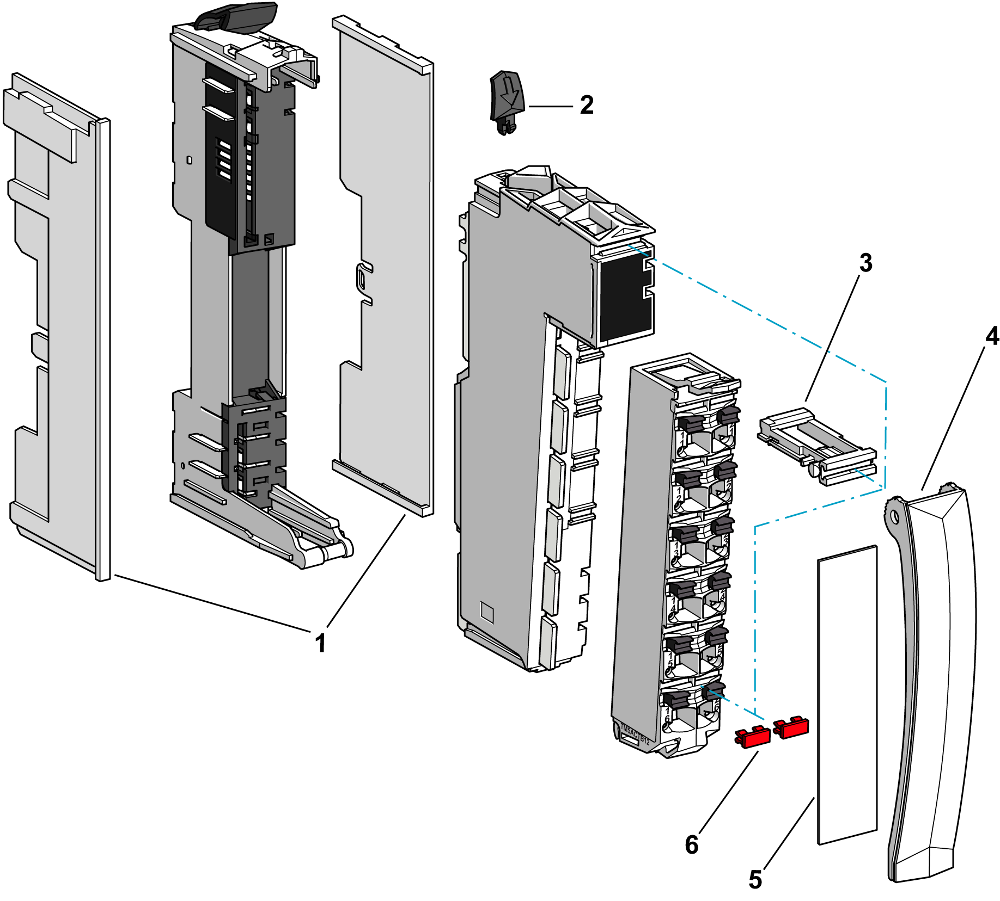

# Accessories for the TM5 System

## Overview

The TM5 accessories include the following:

**1** Left and right bus base locking plates

**2**  Electronic module locking clip

**3** Terminal locking clip

**4** Plain text cover holder

**5** Legend strips

**6** Label tab

## Bus Base Locking Plate

The bus base locking plate helps protect the TM5 bus exposed contacts on either the right and/or the left side of the TM5 system configuration:

| Reference | Description | |
| --- | --- | --- |
| TM5ACLPL10 | 10 left bus base locking plates |  |
| TM5ACLPR10 | 10 right bus base locking plates |

You must use the bus base locking plate to help avoid damage to the TM5 during installation from electrostatic discharge.

| NOTICE | |
| --- | --- |
|  | ELECTROSTATIC DISCHARGE  * Install a right bus base locking plate to the rightmost slice of all configurations. * Install a left bus base locking plate to the first slice of all remote configurations.  Failure to follow these instructions can result in equipment damage. |

## Electronic Module Locking Clip

The [locking clip](D-SE-0001024.html#D-SE-0001024__D-SE-0001024.3) helps to securely lock the electronic module to the bus base:

| Reference | Description |
| --- | --- |
| TM5ACADL100 | Locking clip (x100) |

## Terminal Locking Clip

The [terminal locking clip](D-SE-0001024.html#D-SE-0001024__D-SE-0001024.3) helps to secure the terminal block to the electronic module:

| Reference | Description |
| --- | --- |
| TM5ACTLC100 | Terminal locking clip (x100) |

## Label Tabs and Labeling Tool

The label tabs are used for:

* [labeling](D-SE-0001023.html#D-SE-0001023),
* [coding](D-SE-0000888.html#D-SE-0000888).

The following table gives you the references of the three colored label tabs:

| Reference | Description | |
| --- | --- | --- |
| TM5ACLITW1 | White label tabs, for 16 modules |  |
| TM5ACLITR1 | Red label tabs, for 16 modules |
| TM5ACLITB1 | Blue label tabs, for 16 modules |

The following labeling tool is needed for installing the label tabs, and the coding system between the connectors and the electronic modules:

| Reference | Description |
| --- | --- |
| TM5ACLT1 | Labeling insert tool for label tabs    **1** Double-width cutters  **2** Single-width cutters |

## Plain Text Cover Holder

In addition to the label tabs, the cover holder allows plain text labeling. The [plain text cover holder](D-SE-0001024.html#D-SE-0001024__D-SE-0001024.5) is attached to the terminal locking clip:

| Reference | Description | |
| --- | --- | --- |
| TM5ACTCH100 | Plain text cover holder (x100) |  |
| TM5ACTLS100 | Legend strip for cover holder (x100) |

## TM5 Bus Expansion Cable

The TM5 bus expansion cable is used between Transmitter and Receiver modules for TM5 data bus:

| Reference | Description |
| --- | --- |
| TCSXCNNXNX100 | Expansion bus cable 100 m (328 ft) |

Refer to [*Modicon TM5 Transmitter and Receiver Modules Hardware Guide*](../../../../../api/crossBook?lang=en-US&virtualBookName=tm5bushw&topicID=D_SE_0003232) for connections.

## TM2XMTGB Grounding Plate

The TM2XMTGB Grounding Plate is an accessory used in the [TM5 grounding step](D-SE-0002601.html#D-SE-0002601) of the TM5 System installation:

| Reference | Description |
| --- | --- |
| TM2XMTGB | Grounding Plate |

| WARNING | |
| --- | --- |
|  | ACCIDENTAL DISCONNECTION FROM PROTECTIVE GROUND (PE)  * Do not use the TM2XMTGB Grounding Plate to provide a protective ground (PE). * Use the TM2XMTGB Grounding Plate only to provide a functional ground (FE).  Failure to follow these instructions can result in death, serious injury, or equipment damage. |

EIO0000001058.04

© 2020

Schneider Electric.

All rights reserved.