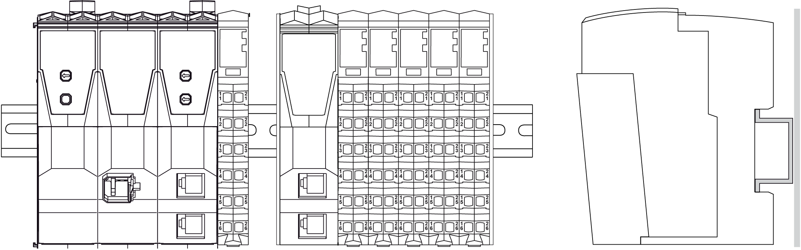
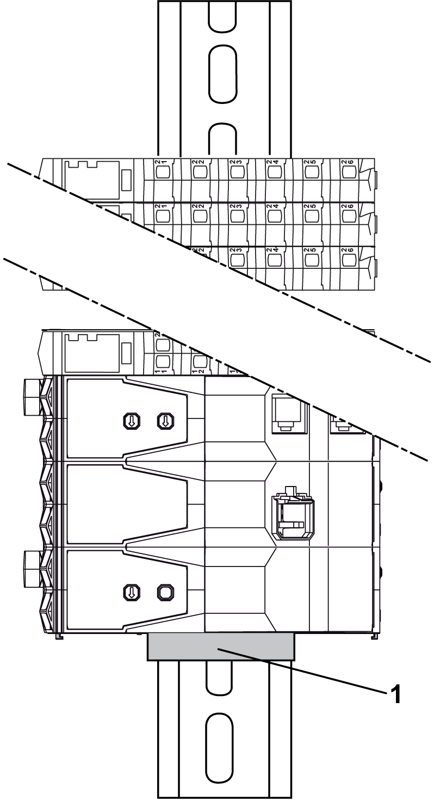
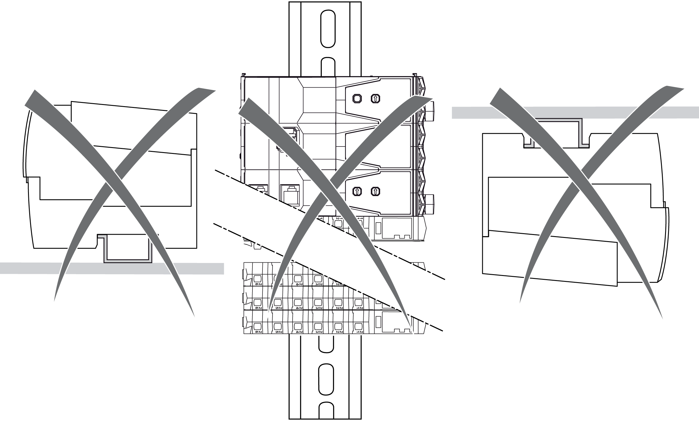

# Mounting Positions

## Introduction

This section shows the correct mounting positions for the TM5 System.

Remote and distributed configurations follow the same rules.

The TM5 System should only be positioned as shown in the correct or acceptable mounting position figures below.

## Correct Mounting Position

The TM5 System must be mounted horizontally on a vertical plane as shown in the figures below:

NOTE: Keep adequate spacing for proper ventilation and to maintain an ambient temperature as described in the [environmental characteristics](D-SE-0015384.html#D-SE-0015384).

## Acceptable Mounting Positions

Whenever possible, the TM5 System should only be positioned in the horizontal mounting position. This position affords the best heat dissipation of the devices.

Whenever possible, the TM5 Safety-Related System should only be positioned in the horizontal mounting position. This position affords the best heat dissipation of the devices.

The TM5 System can also be mounted sideways on a vertical plane as shown below.

**1** End bracket

| NOTICE | |
| --- | --- |
|  | INOPERABLE EQUIPMENT  * Mount the expansion modules on top of the controller when mounting on a vertical plane. * Secure the first element of the TM5 configuration (controller, receiver and any slices) against slipping.  Failure to follow these instructions can result in equipment damage. |

## Incorrect Mounting Position

The figures below show incorrect mounting positions:

EIO0000001058.04

© 2020

Schneider Electric.

All rights reserved.