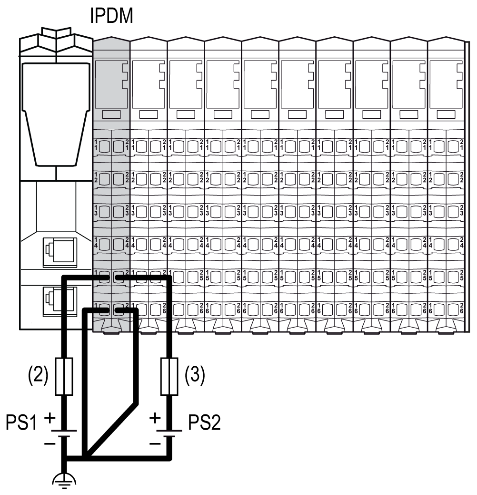
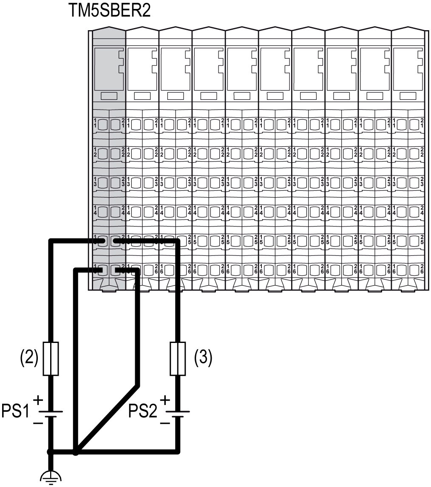
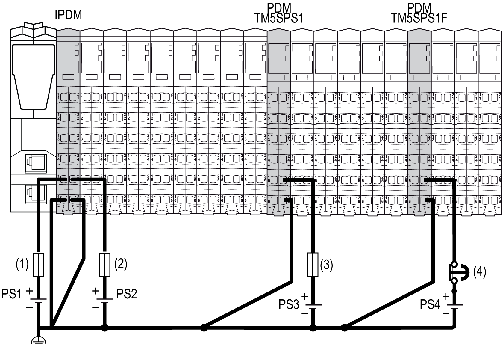
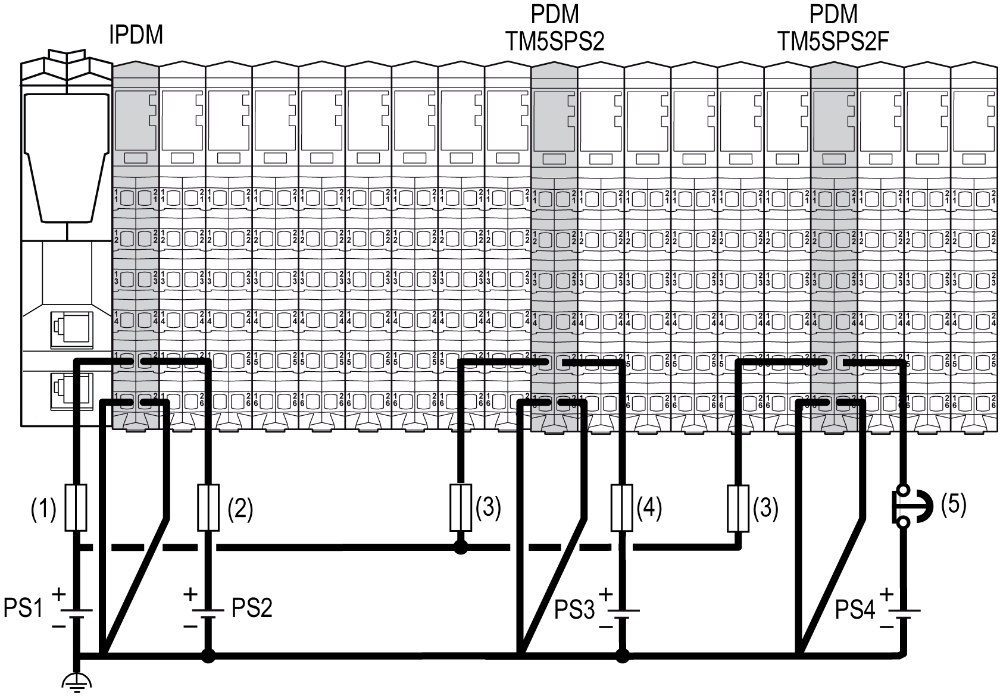

# Wiring the Power Supply

## Overview

To distribute current for the 24 Vdc I/O power segment(s) and TM5 power bus according to the [power distribution description](D-SE-0015387.html#D-SE-0015387), the following modules are connected to an external source:

* Interface Power Distribution Module (IPDM)
* Receiver module (TM5SBER2)
* Power Distribution Module (PDM) TM5SPS1•
* Power Distribution Module (PDM) TM5SPS2•

Source power for these can come from one or more supplies. Your requirements are dictated by:

* voltage and current needs
* isolation requirements

| DANGER | |
| --- | --- |
|  | HAZARD OF ELECTRIC SHOCK, EXPLOSION, OVERHEATING AND FIRE  * Do not connect the modules directly to line voltage. * Use only isolating PELV systems according to IEC 61140 to supply power to the modules. * Connect the 0 Vdc of the external power supplies to FE (Functional Earth/ground).  Failure to follow these instructions will result in death or serious injury. |

## Wiring the Interface Power Distribution Module (TM5SPS3)

The [IPDM (TM5SPS3)](D-SE-0015387.html#D-SE-0015387__D-SE-0015387.27) is the first connection of the distributed configuration to the external 24 Vdc power supplies. Power is supplied by two external isolated power supplies.

There are two power connections to be made to the IPDM (IPDM TM5SPS3) from your source power supplies:

| Connections | 2 Power Supplies |
| --- | --- |
| 24 Vdc Main power that generates power for TM5 power bus | PS1 |
| 24 Vdc I/O power segment | PS2 |

**(2)** External fuse, Type T slow-blow, 1 A, 250 V

**(3)** External fuse, Type T slow-blow, 10 A maximum, 250 V

**PS1/PS2** External isolated power supply 24 Vdc

NOTE: Connect the 0 Vdc power circuits together and to the functional ground (FE) of your system to meet the EMC requirements.

| DANGER | |
| --- | --- |
|  | HAZARD OF ELECTRIC SHOCK, EXPLOSION, OVERHEATING AND FIRE  * Do not connect the modules directly to line voltage. * Use only isolating PELV systems according to IEC 61140 to supply power to the modules. * Connect the 0 Vdc of the external power supplies to FE (Functional Earth/ground).  Failure to follow these instructions will result in death or serious injury. |

## Wiring the Receiver Module (TM5SBER2)

The [receiver module (TM5SBER2)](D-SE-0015387.html#D-SE-0015387__D-SE-0015387.24) is the first connection of the remote configuration to the external 24 Vdc power supplies. Power is supplied by two external isolated power supplies.

There are two power connections to be made to the receiver module (TM5SBER2) from your source power supplies:

| Connections | 2 Power Supplies |
| --- | --- |
| 24 Vdc Main power that generates power for TM5 power bus | PS1 |
| 24 Vdc I/O power segment | PS2 |

**(2)** External fuse, Type T slow-blow, 1 A, 250 V

**(3)** External fuse, Type T slow-blow, 10 A maximum, 250 V

**PS1/PS2** External isolated power supply 24 Vdc

NOTE: Connect the 0 Vdc power circuits together and to the functional ground (FE) of your system to meet the EMC requirements.

| DANGER | |
| --- | --- |
|  | HAZARD OF ELECTRIC SHOCK, EXPLOSION, OVERHEATING AND FIRE  * Do not connect the modules directly to line voltage. * Use only isolating PELV systems according to IEC 61140 to supply power to the modules. * Connect the 0 Vdc of the external power supplies to FE (Functional Earth/ground).  Failure to follow these instructions will result in death or serious injury. |

## Wiring the Power Distribution Module TM5SPS1•

The TM5SPS1• (PDM) divides the 24 Vdc I/O power segment into several separated [24 Vdc I/O power segments](D-SE-0015387.html#D-SE-0015387__D-SE-0015387.18). Each separated 24 Vdc I/O power segment is supplied by one external isolated power supply depending on current needs and capabilities.

There is one power connection to be made to each TM5SPS1• (PDM) from your source power supplies:

| Segment Begin | Connection | Power Supplies |
| --- | --- | --- |
| IPDM for the distributed configuration | 24 Vdc Main power that generates power for TM5 power bus | PS1 |
| 24 Vdc I/O power segment 1 | PS2 |
| First PDM (from left to right) of the configuration | 24 Vdc I/O power segment 2 | PS3 |
| Second PDM (from left to right) of the configuration | 24 Vdc I/O power segment 3 | PS4 |
| ... | ... | ... |

The following figure shows the wiring to supply the 24 Vdc I/O power segments:

**1** External fuse, Type T slow-blow, 1 A, 250 V

**2** External fuse, Type T slow-blow, 10 A, 250 V

**3** External fuse, Type T slow-blow, 10 A maximum, 250 V

**4** Approved emergency stop device

**PS1/PS2/PS3/PS4** External isolated power supply 24 Vdc

NOTE: Connect the 0 Vdc power circuits together and to the functional ground (FE) of your system to meet the EMC requirements.

| DANGER | |
| --- | --- |
|  | HAZARD OF ELECTRIC SHOCK, EXPLOSION, OVERHEATING AND FIRE  * Do not connect the modules directly to line voltage. * Use only isolating PELV systems according to IEC 61140 to supply power to the modules. * Connect the 0 Vdc of the external power supplies to FE (Functional Earth/ground).  Failure to follow these instructions will result in death or serious injury. |

NOTE: The requirements for the power supply are different for the input and the output slices. An emergency stop is generally used with the power supply providing power for output slices.

## Wiring the Power Distribution Module TM5SPS2•

The TM5SPS2• (PDM) divides the 24 Vdc I/O power segment into several separated [24 Vdc I/O power segments](D-SE-0015387.html#D-SE-0015387__D-SE-0015387.18) and reinforces the [TM5 power bus](D-SE-0015387.html#D-SE-0015387__D-SE-0015387.23).

[Selecting a 24 Vdc power supply](D-SE-0002306.html#D-SE-0002306) should be based on current needs and capabilities.

Each separated 24 Vdc I/O power segment is supplied by one external isolated power supply depending on current needs and capabilities.

There are two power connections to be made to each TM5SPS2• (PDM) from your source power supplies:

| Segment Begin | Connection | Power Supplies |
| --- | --- | --- |
| IPDM for the distributed configuration | 24 Vdc Main power that generates power for TM5 power bus | PS1 |
| 24 Vdc I/O power segment 1 | PS2 |
| First PDM (from left to right) of the configuration | 24 Vdc Main power that generates power to reinforce the TM5 power bus | PS1 |
| 24 Vdc I/O power segment 2 | PS3 |
| Second PDM (from left to right) of the configuration | 24 Vdc Main power that generates power to reinforce the TM5 power bus | PS1 |
| 24 Vdc I/O power segment 3 | PS4 |
| ... | ... | ... |

In the following example, the PS1 is connected to the Main power. In this case the 2 TM5SPS2• PDMs are connected to PS1 to supply the TM5 power bus:

**(1)** External fuse, Type T slow-blow, 1 A, 250 V

**(2)** External fuse, Type T slow-blow, 10 A, 250 V

**(3)** External fuse, Type T slow-blow, 1 A, 250 V

**(4)** External fuse, Type T slow-blow, 10 A maximum, 250 V

**(5)** Approved emergency stop device

**PS1/PS2/PS3/PS4** External isolated power supply 24 Vdc

NOTE: Connect the 0 Vdc power circuits together and to the functional ground (FE) of your system to meet the EMC requirements.

| DANGER | |
| --- | --- |
|  | HAZARD OF ELECTRIC SHOCK, EXPLOSION, OVERHEATING AND FIRE  * Do not connect the modules directly to line voltage. * Use only isolating PELV systems according to IEC 61140 to supply power to the modules. * Connect the 0 Vdc of the external power supplies to FE (Functional Earth/ground).  Failure to follow these instructions will result in death or serious injury. |

NOTE: The requirements for the power supply are different for the input and the output slices. An emergency stop is generally used with the power supply providing power for output slices.

EIO0000001058.04

© 2020

Schneider Electric.

All rights reserved.