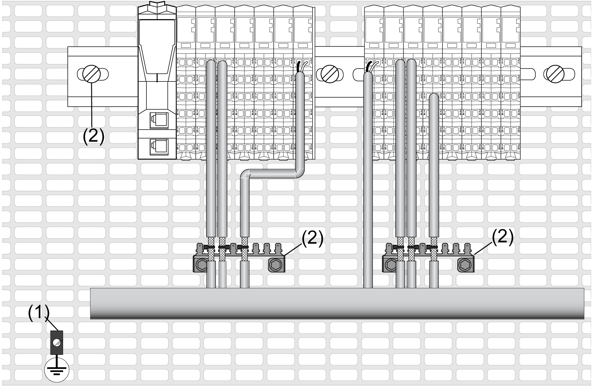
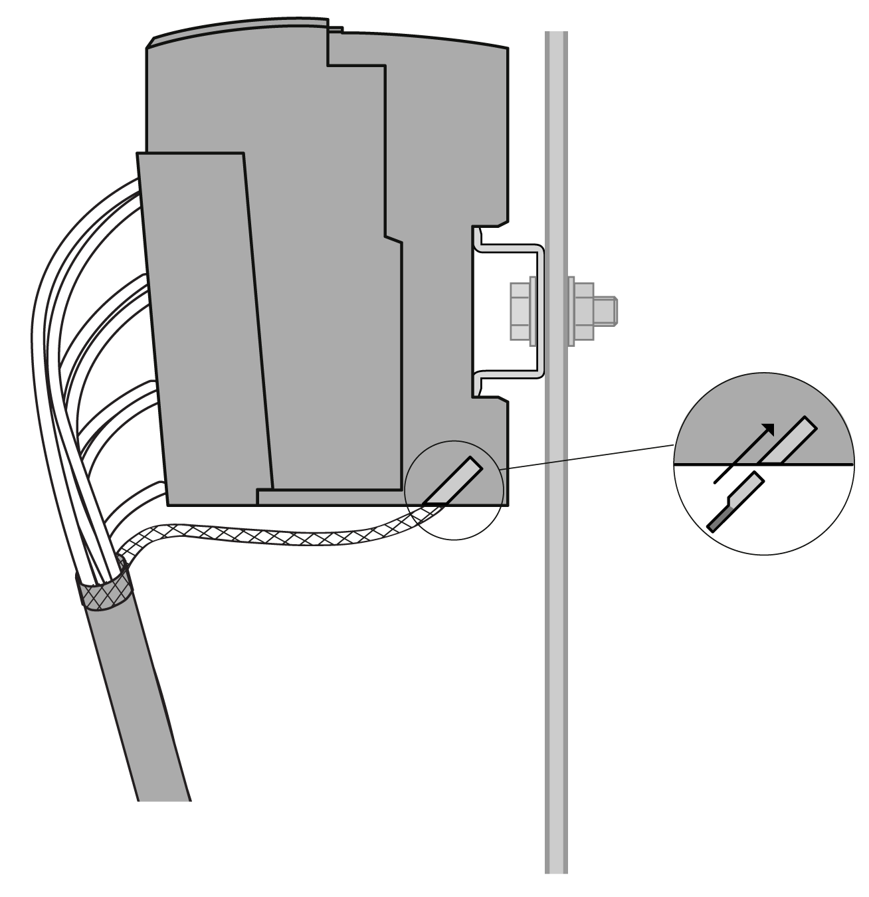

# Grounding the System

## Introduction

Use shielded, properly grounded cables for all analog and high-speed inputs or outputs and communication connections. If you do not use shielded cable for these connections, electromagnetic interference can cause signal degradation. Degraded signals can cause the controller or attached modules and equipment to perform in an unintended manner.

| WARNING | |
| --- | --- |
|  | UNINTENDED EQUIPMENT OPERATION  * Use shielded cables for all fast I/O, analog I/O and communication signals. * Ground cable shields for all analog I/O, fast I/O and communication signals at a single point1. * Route communication and I/O cables separately from power cables.  Failure to follow these instructions can result in death, serious injury, or equipment damage. |

1Multipoint grounding is permissible if connections are made to an equipotential ground plane dimensioned to help avoid cable shield damage in the event of power system short-circuit currents.

The  use of shielded cables requires compliance with the following wiring rules:

* For protective ground connections (PE), metal conduit or ducting can be used for part of the shielding length, provided there is no break in the continuity of the ground connections. For functional ground (FE), the shielding is intended to attenuate electromagnetic interference and the shielding must be continuous for the length of the cable. If the purpose is both functional and protective, as is often the case for communication cables, the cable should have continuous shielding.
* Wherever possible, keep cables carrying one type of signal separate from the cables carrying other types of signals or power.

The figure below represents a TM5 System with shielded cables:

**1** Protective ground (PE)

**2** Functional ground (FE)

## Protective Ground (PE) on the Backplane

The protective ground (PE) is connected to the conductive backplane by a heavy-duty wire, usually a braided copper cable with a cross-section of 6 mm2 (AWG 10) or larger.

## Functional Ground (FE) on the DIN Rail

The DIN Rail for your TM5 System is common with the functional ground (FE) plane and must be mounted on a conductive backplane.

| WARNING | |
| --- | --- |
|  | UNINTENDED EQUIPMENT OPERATION  Connect the DIN rail to the functional ground (FE) of your installation.  Failure to follow these instructions can result in death, serious injury, or equipment damage. |

The connection between the functional ground (FE) and your TM5 System is made by the [DIN Rail contacts](D-SE-0015379.html#D-SE-0015379__D-SE-0015379.5) on the back of the controller and the bus base of the expansion modules.

## Shielded Cables Connections

Cables carrying the fast I/O, analog I/O, network and Sercos III bus communication signals must be shielded. The shielding must be securely connected to ground. The fast I/O and analog I/O shields may be connected either to the functional ground (FE) of your system via the TM2XMTGB grounding plate or to the protective ground (PE). The Sercos III bus communication cable shields must be connected to the protective ground (PE) with a connecting clamp secured to the conductive backplane of your installation.

| DANGER | |
| --- | --- |
|  | HAZARD OF ELECTRIC SHOCK  Make sure that CANopen and Modbus cables are securely connected to the protective ground (PE).  Failure to follow these instructions will result in death or serious injury. |

| WARNING | |
| --- | --- |
|  | ACCIDENTAL DISCONNECTION FROM PROTECTIVE GROUND (PE)  * Do not use the TM2XMTGB Grounding Plate to provide a protective ground (PE). * Use the TM2XMTGB Grounding Plate only to provide a functional ground (FE).  Failure to follow these instructions can result in death, serious injury, or equipment damage. |

NOTE: The functional ground of the Ethernet connection is internal.

## Functional Ground (FE) Cable Shielding

Alternative 1: Connect the shield of a cable via the Grounding Plate:

| Step | Description | |
| --- | --- | --- |
| 1 | Install the [Grounding Plate](D-SE-0000784.html#D-SE-0000784__D-SE-0000784.10) directly on the conductive backplane below the TM5 System as illustrated. |  |
| 2 | Strip the shielding for a length of 15 mm (0.59 in.) |  |
| 3 | Tightly clamp on the blade connector **(1)** using nylon fastener **(2)**(width 2.5...3 mm (0.1...0.12 in.)) and appropriate tool. |  |

Alternative 2: Connect the shield of a cable via the grounding connector on the bus base of the TM5 I/O modules:

Twist the shield of all shielded cables of a module and connect them with a cable end (2.8 x 0.5 mm / 0.11 x 0.02 in) to the grounding connector of the TM5 I/O modules.

## Protective Ground (PE) Cable Shielding

To ground the shield of a cable via a grounding clamp:

| Step | Description | |
| --- | --- | --- |
| 1 | Strip the shielding for a length of 15 mm (0.59 in.) |  |
| 2 | Attach the cable to the conductive backplane plate by attaching the grounding clamp to the stripped part of the shielding as close as possible to the TM5 System base. |  |

NOTE: The shielding must be clamped securely to the conductive backplane to help ensure good contact.

EIO0000001058.04

© 2020

Schneider Electric.

All rights reserved.