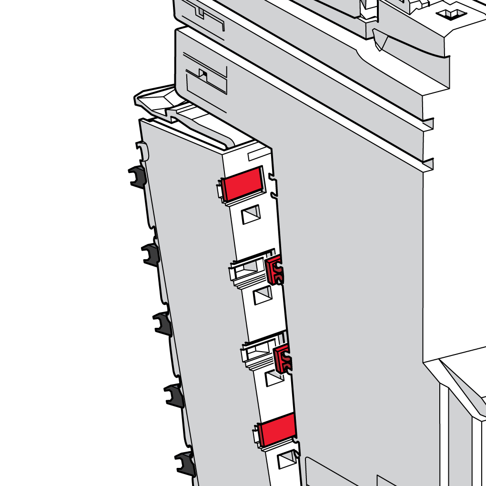

# Coding the TM5 System

## Introduction

To help reduce the likelihood of mismatches during mounting and maintenance operations, the association between the terminal blocks and the electronic modules can be coded.

The following image illustrates a coding of the electronic module and of the terminal block:

The [label tabs and labeling tool](D-SE-0000784.html#D-SE-0000784__D-SE-0000784.5) accessories are required to code the terminal block and the electronic module.

## Creating a Coding Scheme

There are many coding schemes you can use for the TM5 System. Here are some strategies that you can use:

* Code adjacent modules differently.
* Code each type of slice (input, output, digital, analog, 24 Vdc, 120 Vac, 240 Vac...) with a different pattern.
* Be sure your coding scheme is unique.

The following table shows you some unique combinations to code your TM5 System:

| 1 | | 2 | | 3 | | 4 | | 5 | | 6 | |
| --- | --- | --- | --- | --- | --- | --- | --- | --- | --- | --- | --- |
| A | B | A | B | A | B | A | B | A | B | A | B |
|  | |  | |  | |  | |  | |  | |
| **A** Slots on the terminal block  **B** Slots on the electronic module  represents an [electronic module slot](D-SE-0015379.html#D-SE-0015379__D-SE-0015379.6) with a label tab.  represents an electronic module slot without a label tab.  represents a [terminal block slot](D-SE-0015379.html#D-SE-0015379__D-SE-0015379.7) with a label tab.  represents a terminal block slot without a label tab. | | | | | | | | | | | |

## How to Install the Label Tabs for Coding

The following table describes how to code the terminal block and the electronic module:

| Step | Action |  |
| --- | --- | --- |
| 1 | Grip the desired label tab with the single-width cutters of the labeling tool. |  |
| 2 | Press with the labeling tool to separate the label. |  |
| 3 | Center the label tab over [the slot](D-SE-0015379.html#D-SE-0015379__D-SE-0015379.6) on the electronic module. |  |
| 4 | Hold the labeling tool at a 90° angle to the electronic module and press to insert the label's feet into the slot.  NOTE: Repeat step 1 and 2 to remove a label tab with the single-width cutter of the labeling tool. | |
| 5 | Set the label tab in [the slot](D-SE-0015379.html#D-SE-0015379__D-SE-0015379.7) on the back of the terminal block as shown. |  |
| 6 | Use the labeling tool to push the left feet of the label into the slot. |  |
| 7 | With the labeling tool, press the right feet of the label into the slot.  **Result**: Inserted label for terminal coding. |  |

EIO0000001058.04

© 2020

Schneider Electric.

All rights reserved.