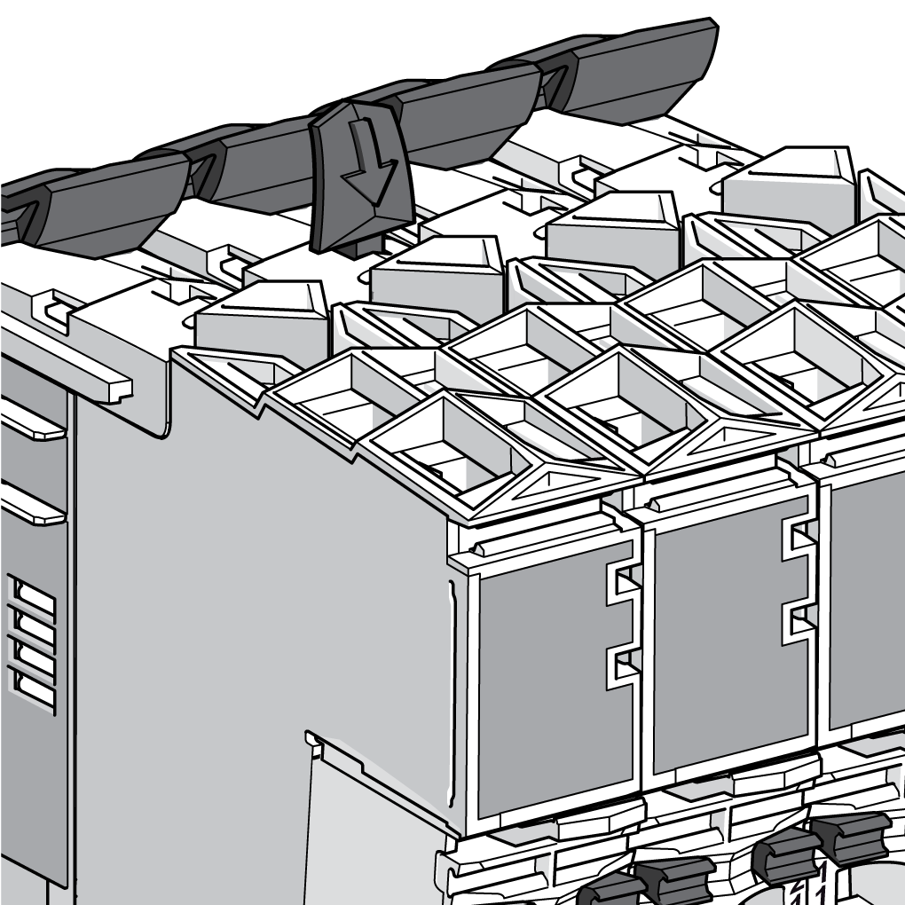

# Installation of Accessories

## Locking Clip

The locking clip attaches the electronic module to the bus base. The locking clip is inserted in the appropriate opening on the top of the slice and pushed down.

## Terminal Locking Clip

The terminal locking clip attaches to the terminal block to help secure it to the electronic module.

The following table describes how to install the terminal locking clip:

| Step | Action | |
| --- | --- | --- |
| 1 | Set the terminal locking clip on the terminal block locking lever as shown. |  |
| 2 | Push down and hold the terminal locking clip and the locking lever with your index finger. Slide the terminal locking clip forward with your thumb. |  |
| 3 | Hang the bottom edge of the terminal block in its hinge on the bus module. |  |
| 4 | Rotate the terminal block up into place. |  |
| 5 | Secure the terminal block in the electronic module by pushing in the terminal locking clip. |  |
| 6 | Installed terminal locking clip. |  |

NOTE: To remove the terminal block, reverse Step 5 by pulling out the terminal locking clip.

## Plain Text Cover

The covers are attached to the terminal locking clips:

| Step | Action | |
| --- | --- | --- |
| 1 | Hold the plain text cover at a 90° angle to the terminal locking clip. | |
| 2 | Push the plain text cover into the terminal locking clip until it clicks into the slot on the clip. |  |
| 3 | Insert the [plain text legend](D-SE-0000784.html#D-SE-0000784__D-SE-0000784.8) strips. |  |

EIO0000001058.04

© 2020

Schneider Electric.

All rights reserved.