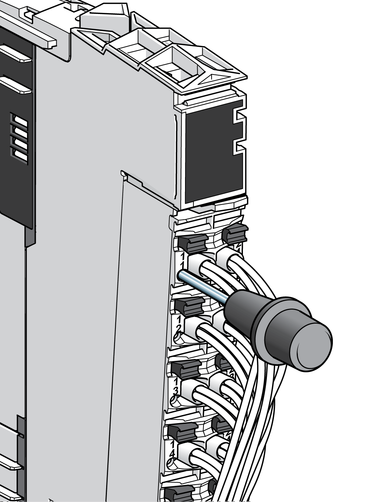

# Diagnostics

## Introduction

The TM5 System offer several levels of diagnostics:

* Test points on the terminal blocks
* Directly on the module using LED displays
* Via  software (Diagnostics, Message Logger, I/O Mapping, Safe Logger)

## Test Points

Each [terminal block](D-SE-0015379.html#D-SE-0015379__D-SE-0015379.7) has an access point for a test probe. You can measure the terminal potential without disconnecting the wire.

The following figure illustrates the use of the test probes:

## Status LEDs

TM5 bus status, power, I/O status and channel states are displayed in direct relationship to the channels or the function. The different states are displayed differently, for example green for OK, red for detected error.

Refer to the hardware guides for the products of the TM5 System for status LEDs descriptions.

EIO0000001058.04

© 2020

Schneider Electric.

All rights reserved.