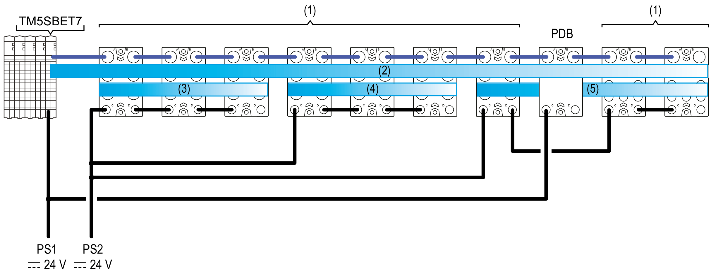

# TM7 Power Distribution Description

## Power Distribution Overview

In a [remote configuration](D-SE-0015375.html#D-SE-0015375__D-SE-0015375.9), the TM5SBET7 Transmitter module generates power for the TM7 power bus. The first I/O block of the remote configuration after a TM5SBET7 distributes power for the first 24 Vdc I/O power segment.

There are other components that generate supplemental power to the TM7 power bus, or distribute power to create separate 24 Vdc I/O power segments. For example, Power Distribution Blocks (PDB) can be added to provide supplementary power to the TM7 power bus if required by your I/O configuration. Another example, you connect a power supply to a I/O block to divide the 24 Vdc I/O power segment into several separated 24 Vdc I/O power segments.

The figure below shows a representation of the power distribution overview for a remote configuration. Refer to the section [Wiring the Power Supply](D-SE-0009316.html#D-SE-0009316) for details on connectors wiring:

**(1)** TM7 I/O blocks

**(2)** TM7 Power bus

**(3...5)** 24 Vdc I/O power segments

**TM5SBET7** Transmitter module

**PDB** Power Distribution Block

**PS1** External isolated main power supply, 24 Vdc

**PS2** External isolated I/O power supply, 24 Vdc

## TM7 Power Bus Description

The TM7 bus consists in two parts:

* TM7 data bus
* TM7 power bus

The TM7 power bus distributes the power to supply the electronics of the I/O blocks. If needed, the power on the TM7 bus can be reinforced by adding a PDB.

In a remote configuration, the TM7 data and power busses begin with a TM5SBET7 transmitter module.

NOTE: The TM5SBET7 transmitter module must be the last electronic module in the remote TM5 configuration that you intend to extend.

## 24 Vdc I/O Power Segment Description

Power is distributed to the inputs and outputs of the TM7 System through the 24 Vdc I/O power segment.

The 24 Vdc I/O power segment begins with the first TM7 component of the configuration and is terminated at the point where another I/O block is connected to a power supply or at the end of the configuration.

A segment is a group of I/O blocks connected to each other via the 24 Vdc power IN and 24 Vdc power OUT connectors.

The reasons to build a new segment are:

* To separate groups of I/O blocks. For example, a group of inputs separated from a group of outputs.
* Because the power supplied to the preceding 24 Vdc I/O power segment is fully consumed by the devices on that segment.

## Transmitter Module (TM5SBET7)

The TM5SBET7 Transmitter Module supplies power to the TM7 power bus, and also relays data from the Sercos III Bus Interface to the remote expansion devices through the TM7 data bus.

Depending on the mounting position of the TM5SBET7 transmitter module, the number of TM7 expansion I/O blocks connected without a PDB is limited to:

| TM5SBET7 Position | Maximum Number of TM7 I/O Blocks |
| --- | --- |
| Horizontal | 8 |
| Vertical | 6 |

| WARNING | |
| --- | --- |
|  | UNINTENDED EQUIPMENT OPERATION  * Do not connect more than 8 blocks to a TM5SBET7 installed in a horizontal orientation. * Do not connect more than 6 blocks to a TM5SBET7 installed in a vertical orientation.  Failure to follow these instructions can result in death, serious injury, or equipment damage. |

NOTE: To install more than 6 or 8 blocks (according to the installation orientation of the TM5SBET7) of TM7 remote I/O, you will need to add a Power Distribution Block.

## Power Distribution Block (PDB)

The Power Distribution Blocks (PDBs) are used to reinforce the voltages and currents distributed by the TM7 power bus. Any of the following may require you to add PDBs to reinforce the TM7 power bus:

* No PDBs have been installed, and the number of I/O blocks exceeds the maximum number that can be supported by the TM5SBET7 transmitter module based on installation orientation. For more information, refer to [Transmitter Module](#D-SE-0009310__D-SE-0009310.24).
* The installed transmitter module and PDBs are adequate to the I/O block current consumption and cable lengths, but you desire redundant power in the event a PDB becomes inoperative.
* The cumulative power consumption of the I/O block electronics exceeds the maximum output current available from the TM5SBET7 transmitter module and any PDBs already installed. For more information, refer to [Current Supplied and Consumption Tables on the TM7 Power Bus](D-SE-0015413.html#D-SE-0015413).
* The maximum number of I/O blocks that can be powered by the existing transmitter module and PDBs has been installed, and the cable run from the first I/O block to the last exceeds 100 m (328 ft).

NOTE: If the distance from the first to the last I/O block on a fully populated TM7 power bus exceeds 100 m (328 ft), the voltage drop on the cable can reduce the maximum number of TM7 I/O blocks that can be powered. In these circumstances, add a PDB and verify that the supply voltage to each I/O block is within limits.

## Supplying the TM7 Power Bus

The table below gives the maximum current supplied to the TM7 power bus:

| Equipment | Current Supplied to the TM7 Power Bus in a Horizontal Mounting Orientation | | Current Supplied to the TM7 Power Bus in a Vertical Mounting Orientation |
| --- | --- | --- | --- |
| 0...55 °C (32...131 °F) | 55...60 °C (131...140 °F) | 0...50 °C (32...122 °F) |
| TM5SBET7 | 304 mA | 228 mA | 228 mA |
| TM7SPS1A | 750 mA | | |

## Supplying the 24 Vdc I/O Power segment

The table below gives the maximum current distributed on the 24 Vdc I/O Power segment:

| Equipment | Maximum Current |
| --- | --- |
| TM5SBET7 | – |
| TM7SPS1A | – |
| TM7 I/O Block(1) | 8 A |
| **(1)** When connecting the 24 Vdc I/O power IN connector to an external power supply | |

EIO0000001058.04

© 2020

Schneider Electric.

All rights reserved.