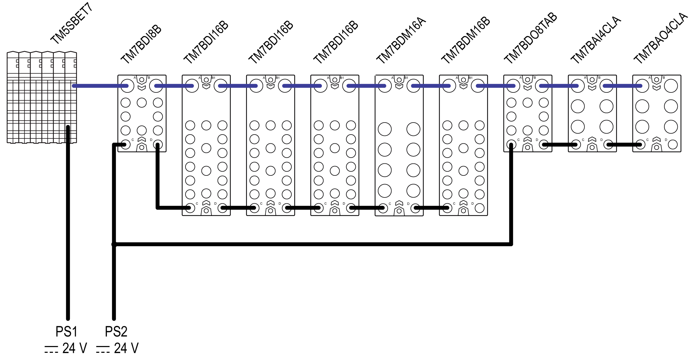
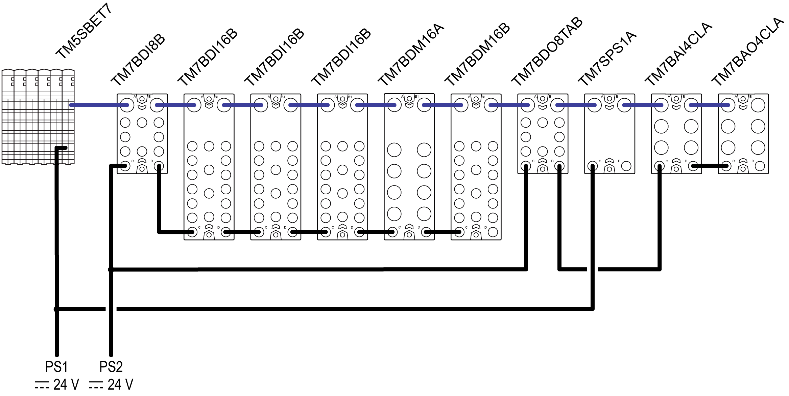

# Example: Current Consumed by a Remote Configuration

## Introduction

This example is for a [remote configuration](D-SE-0015375.html#D-SE-0015375) (TM5 Transmitter module and TM7 expansion I/O blocks). From this example, you should be able to make the calculations necessary for your TM7 System.

Current consumption values are documented in the chapter [TM7 Power Consumption Tables](D-SE-0009387.html#D-SE-0009387).

## Planning Example

This configuration example includes:

* The TM5SBET7 transmitter module.
* Some expansion blocks:

  + TM7BDI8B
  + TM7BDI16B (x3)
  + TM7BDM16A
  + TM7BDM16B
  + TM7BDO8TAB
  + TM7BAI4CLA
  + TM7BAO4CLA
* Assumptions used for the purposes of calculating the consumption of this example:

  | TM7BDI8B: | This block is connected to the power supply to distribute 8000 mA to the 24 Vdc I/O power segment.  The current to supply the electronic sensors of this example has been estimated at 25 mA per sensor, or 200 mA total for the block. |
  | TM7BDI16B (x3): | The current to supply the electronic sensors of this example has been estimated at 37.5 mA per sensor, or 500 mA total for the block. |
  | TM7BDM16A: | The sum of the current draw for all outputs connected to the block is not more than 2500 mA at any given time.  The current to supply the electronic sensors of this example has been estimated at 12.5 mA per sensor, or 100 mA total for the block. |
  | TM7BDM16B: | The sum of the current draw for all outputs connected to the block is not more than 2000 mA at any given time.  The current to supply the electronic sensors of this example has been estimated at 25 mA per sensor, or 200 mA total for the block. |
  | TM7BDO8TAB: | This block is connected to the power supply to distribute 8000 mA to the 24 Vdc I/O power segment.  Only 6 of the outputs are active at any given time, and that the maximum current draw of any given output is 1000 mA, or 5000 mA total for the block. |
  | TM7BAI4CLA | The consumption of the block is 38 mA (from main power supply).  The consumption of the electronics of the block is 125 mA (from I/O power supply). |
  | TM7BAO4CLA | The consumption of the block is 38 mA (from main power supply).  The consumption of the electronics of the block is 188 mA (from I/O power supply). |

The following graphic shows the example configuration connected to the power supplies PS1 and PS2:

**PS1** External isolated main power supply, 24 Vdc

**PS2** External isolated I/O power supply, 24 Vdc

For important information concerning power supply connections, TM5SBET7, PDB, I/O Block, refer to [Wiring the Power Supply](D-SE-0009316.html#D-SE-0009316).

The following table shows the current supplied and consumed in mA on the TM7 power bus and the 24 Vdc I/O power segment:

| TM5SBET7 | TM7BDI8B | TM7BDI16B | TM7BDI16B | TM7BDI16B | TM7BDM16A | TM7BDM16B | TM7BDO8TAB | TM7BAI4CLA | TM7BAO4CLA | Legend |
| --- | --- | --- | --- | --- | --- | --- | --- | --- | --- | --- |
| 304 | | | | | | | | | | (1) |
| – | 38 | 38 | 38 | 38 | 38 | 38 | 38 | 38 | 38 | (2) |
|  | 266 | 228 | 190 | 152 | 114 | 76 | 38 | 0 | –38 | (3) |
|  | 8000 | | | | | | 8000 | | | *(4)* |
|  | 42 | 21 | 21 | 21 | 125 | 125 | 84 | 125 | 188 | *(5)* |
|  | 0 | 0 | 0 | 0 | 2500 | 2000 | 6000 | – | – | *(6)* |
|  | 200 | 500 | 500 | 500 | 100 | 200 | – | – | – | *(7)* |
|  | 242 | 521 | 521 | 521 | 2725 | 2325 | 6084 | 125 | 188 | *(8)* |
|  | 7758 | 7237 | 6716 | 6195 | 3470 | 1145 | 1916 | 1791 | 1603 | *(9)* |
| Legend:   | **External isolated main power supply, 24 Vdc** |  | | (1) | Current supplied on the TM7 power bus, in mA | | (2) | Consumption of the TM7 I/O block, in mA | | (3) | Remaining current available after block consumption, in mA | | ***External isolated I/O power supply, 24 Vdc*** |  | | *(4)* | *Current supplied on the 24 Vdc I/O power segment, in mA* | | *(5)* | *Consumption of the electronics of the TM7 I/O block, in mA* | | *(6)* | *Consumption of the loads of the output channels, in mA* | | *(7)* | *Consumption of the supply to sensors, actuators or external devices, in mA* | | *(8)* | *Total TM7 I/O block consumption, in mA* | | *(9)* | *Remaining current available after block consumption, in mA* | | | | | | | | | | | |

## Current Consumed on the TM7 Power Bus

The TM5SBET7 generates 304 mA on the TM7 power bus to supply expansion blocks. The TM7 power bus begins with the TM7BDI8B block and terminates with the TM7BAO4CLA expansion block.

The total current consumed on the TM7 power bus is 342 mA and exceeds the 304 mA capacity of the segment.

Supplement the TM7 power bus by adding a TM7SPS1A between the TM7BDO8TAB and TM7BAI4CLA blocks.

| NOTICE | |
| --- | --- |
|  | EQUIPMENT DAMAGE  Supplement the TM7 power bus by adding a Power Distribution Block (PDB) when the current consumption on the TM7 power bus exceeds the capacity of the segment.  Failure to follow these instructions can result in equipment damage. |

The following table shows the current supplied and consumed in mA on the TM7 power bus:

| TM5SBET7 | TM7BDI8B | TM7BDI16B | TM7BDI16B | TM7BDI16B | TM7BDM16A | TM7BDM16B | TM7BDO8TAB | TM7SPS1A | TM7BAI4CLA | TM7BAO4CLA | Legend |
| --- | --- | --- | --- | --- | --- | --- | --- | --- | --- | --- | --- |
| 304 |  |  |  |  |  |  |  | 750 |  |  | (1) |
|  | 38 | 38 | 38 | 38 | 38 | 38 | 38 |  | 38 | 38 | (2) |
|  | 266 | 228 | 190 | 152 | 114 | 76 | 38 | 788 | 750 | 712 | (3) |
|  | *8000* |  |  |  |  |  | *8000* |  |  |  | *(4)* |
|  | *42* | *21* | *21* | *21* | *125* | *125* | *84* |  | *125* | *188* | *(5)* |
|  | *0* | *0* | *0* | *0* | *2500* | *2000* | *6000* |  | *–* | *–* | *(6)* |
|  | *200* | *500* | *500* | *500* | *100* | *200* | *–* |  | *–* | *–* | *(7)* |
|  | *242* | *521* | *521* | *521* | *2725* | *2325* | *6084* |  | *125* | *188* | *(8)* |
|  | *7758* | *7237* | *6716* | *6195* | *3470* | *1145* | *1916* |  | *1791* | *1603* | *(9)* |
| Legend:   | **External isolated main power supply, 24 Vdc** |  | | (1) | Current supplied on the TM7 power bus, in mA | | (2) | Consumption of the TM7 I/O block, in mA | | (3) | Remaining current available after block consumption, in mA | | ***External isolated I/O power supply, 24 Vdc*** |  | | *(4)* | *Current supplied on the 24 Vdc I/O power segment, in mA* | | *(5)* | *Consumption of the electronics of the TM7 I/O block, in mA* | | *(6)* | *Consumption of the loads of the output channels, in mA* | | *(7)* | *Consumption of the supply to sensors, actuators or external devices, in mA* | | *(8)* | *Total TM7 I/O block consumption, in mA* | | *(9)* | *Remaining current available after block consumption, in mA* | | | | | | | | | | | | |

The total current consumed on the TM7 power bus is 342 mA, and does not exceed the 1054 mA capacity of the TM7 power bus.

The following graphic shows the example configuration (with the PDB) connected to the power supplies PS1 and PS2:

**PS1** External isolated main power supply, 24 Vdc

**PS2** External isolated I/O power supply, 24 Vdc

For important information concerning power supply connections, TM5SBET7, PDB, I/O Block, refer to [Wiring the Power Supply](D-SE-0009316.html#D-SE-0009316).

The next step is to calculate the current consumed on the 24 Vdc I/O power segment to validate the configuration of this example.

## Current Consumed on the 24 Vdc I/O Power Segment

In this example,

* The first 24 Vdc I/O power segment begins with the TM7BDI8B and finishes with the TM7BDM16B. The capacity of this segment is limited to 8000 mA.
* The second 24 Vdc I/O power segment begins with the TM7BDO8TAB and finishes with the TM7BAO4CLA. The capacity of this segment is limited to 8000 mA.

The following table shows the current supplied and consumed in mA on the 24 Vdc I/O power segment:

| TM5SBET7 | TM7BDI8B | TM7BDI16B | TM7BDI16B | TM7BDI16B | TM7BDM16A | TM7BDM16B | TM7BDO8TAB | TM7SPS1A | TM7BAI4CLA | TM7BAO4CLA | Legend |
| --- | --- | --- | --- | --- | --- | --- | --- | --- | --- | --- | --- |
| *304* |  |  |  |  |  |  |  | *750* |  |  | *(1)* |
|  | *38* | *38* | *38* | *38* | *38* | *38* | *38* |  | 38 | 38 | (2) |
|  | *266* | *228* | *190* | *152* | *114* | *76* | *38* | 788 | 750 | 712 | (3) |
|  | 8000 |  |  |  |  |  | 8000 |  |  |  | (4) |
|  | 42 | 21 | 21 | 21 | 125 | 125 | 84 |  | 125 | 188 | (5) |
|  | 0 | 0 | 0 | 0 | 2500 | 2000 | 6000 |  | – | – | (6) |
|  | 200 | 500 | 500 | 500 | 100 | 200 | – |  | – | – | (7) |
|  | 242 | 521 | 521 | 521 | 2725 | 2325 | 6084 |  | 125 | 188 | (8) |
|  | 7758 | 7237 | 6716 | 6195 | 3470 | 1145 | 1916 |  | 1791 | 1603 | (9) |
| Legend:   | ***External isolated main power supply, 24 Vdc*** |  | | *(1)* | *Current supplied on the TM7 power bus, in mA* | | *(2)* | *Consumption of the TM7 I/O block, in mA* | | *(3)* | *Remaining current available after block consumption, in mA* | | **External isolated I/O power supply, 24 Vdc** |  | | (4) | Current supplied on the 24 Vdc I/O power segment, in mA | | (5) | Consumption of the electronics of the TM7 I/O block, in mA | | (6) | Consumption of the loads of the output channels, in mA | | (7) | Consumption of the supply to sensors, actuators or external devices, in mA | | (8) | Total TM7 I/O block consumption, in mA | | (9) | Remaining current available after block consumption, in mA | | | | | | | | | | | | |

The total current consumed on the first 24 Vdc I/O power segment is 6855 mA and does not exceed the 8000 mA capacity of this segment.

The total current consumed on the second 24 Vdc I/O power segment is 6397 mA and does not exceed the 8000 mA capacity of that segment.

| NOTICE | |
| --- | --- |
|  | EQUIPMENT DAMAGE  Create a new segment when the current consumption of the devices on a 24 Vdc I/O power segment exceeds the capacity of the segment.  Failure to follow these instructions can result in equipment damage. |

NOTE: To create a new segment, connect a separate external isolated power supply to 24 Vdc Power In connector of the block that would otherwise cause the current limitation to be exceeded.

EIO0000001058.04

© 2020

Schneider Electric.

All rights reserved.