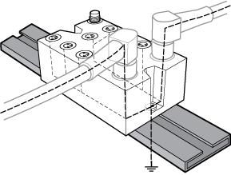
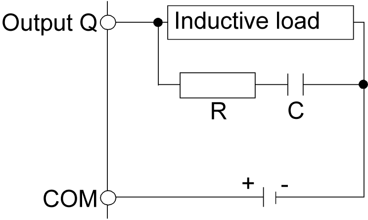
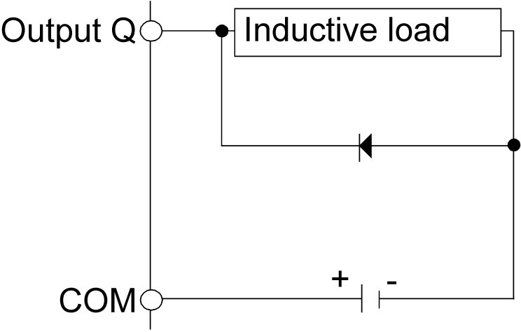
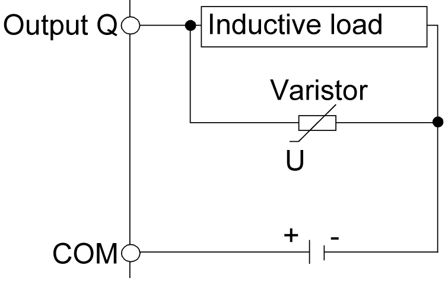

# Wiring Best Practices

## Introduction

There are several rules that must be followed when wiring a TM7 System. Refer to [TM7 Cables](D-SE-0009890.html#D-SE-0009890) for additional details.

## Wiring Rules

| DANGER | |
| --- | --- |
|  | HAZARD OF ELECTRIC SHOCK, EXPLOSION OR ARC FLASH  * Disconnect all power from all equipment including connected devices prior to removing any covers or doors, or installing or removing any accessories, hardware, cables, or wires except under the specific conditions specified in the appropriate hardware guide for this equipment. * Always use a properly rated voltage sensing device to confirm the power is off where and when indicated. * Replace and secure all covers, accessories, hardware, cables, and wires and confirm that a proper ground connection exists before applying power to the unit. * Use only the specified voltage when operating this equipment and any associated products.  Failure to follow these instructions will result in death or serious injury. |

The following rules must be applied when wiring the TM7 System:

* I/O and communication wiring must be kept separate from the power wiring. Route these 2 types of wiring in separate cable ducting.
* Verify that the operating conditions and environment are within the specification values.
* Use proper wire sizes to meet voltage and current requirements.
* Use copper conductors only.
* Use only the [TM7 expansion bus cables](D-SE-0009660.html#D-SE-0009660).

## TM7 Blocks Grounding

The TM7 System blocks, when using Schneider Electric IP67 pre-fabricated cables, incorporate a grounding system intrinsic to the mounting and connecting hardware. The TM7 System blocks must always be mounted on a conductive backplane. The backplane or object used for mounting the blocks (metal machine frame, mounting rail or mounting plate) must be grounded (PE) according to your local, regional and national requirements and regulations. Refer to grounding of your [system blocks](D-SE-0002601.html#D-SE-0002601), for more important information.

NOTE: If you do not use Schneider Electric IP67 pre-fabricated cables, you must use shielded cables and conductive connectors (metal threads on the connector), and be sure to connect the cable shield to the metal sleeve of the connector.

| WARNING | |
| --- | --- |
|  | IMPROPER GROUNDING CONTINUITY  * Use only cables with insulated, shielded jackets. * Use only IP67 connectors with metal threads. * Connect the cable shield to the metal threads of the connectors. * Always comply with local, regional and/or national wiring requirements.  Failure to follow these instructions can result in death, serious injury, or equipment damage. |

The following figure presents the grounding of the TM7 System:

## Protecting Outputs from Inductive Load Damage

Depending on the load, a protection circuit may be needed for the outputs on certain blocks. Inductive loads using DC voltages may create voltage reflections resulting in overshoot that will damage or shorten the life of output devices.

| NOTICE | |
| --- | --- |
|  | INOPERABLE EQUIPMENT  * Be sure that the actuators connected to the TM7 Digital I/O blocks have a built-in protective circuit to reduce the risk of inductive current load damage to the outputs. * If the actuators do not have built-in protection, use an appropriate, IP67 rated external protective circuit to reduce the risk of inductive current load damage to the outputs.  Failure to follow these instructions can result in equipment damage. |

NOTE: The following wiring diagrams are conceptual and are provided as non-definitive guidance for selecting an appropriate IP67 protective device.

Protective circuit A: this protection circuit can be used for DC load power circuits.

* C represents a value from 0.1 to 1 μF.
* R represents a resistor of approximately the same resistance value as the load.

Protective circuit B: this protection circuit can be used for DC load power circuits.

Use a diode with the following ratings:

* Reverse withstand voltage: power voltage of the load circuit x 10.
* Forward current: more than the load current.

Protective circuit C: this protection circuit can be used for DC load power circuits.

In applications where the inductive load is switched on and off frequently and/or rapidly, ensure that the continuous energy rating (J) of the varistor exceeds the peak load energy by 20% or more.

EIO0000001058.04

© 2020

Schneider Electric.

All rights reserved.