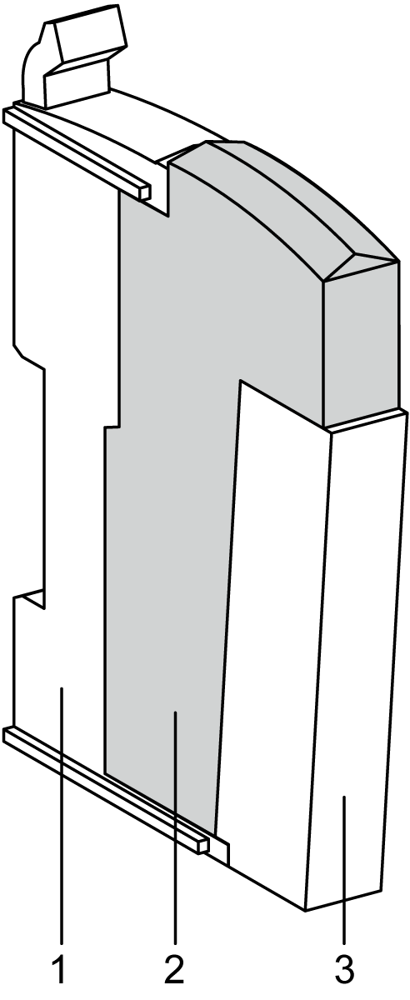
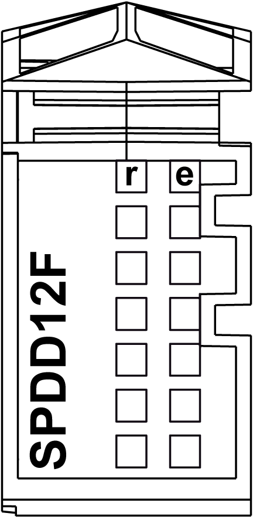

# TM5SPDD12F Presentation

## Main Characteristics

The TM5SPDD12F CDM provides 12 x 24 Vdc terminal connections from the 24 Vdc I/O power segment, which opens up additional wiring possibilities for sensors and actuators.

The module is equipped with an exchangeable fuse between the 24 Vdc potential on the terminal block and the 24 Vdc of the 24 Vdc I/O power segment. The status of the fuse is available with the status LEDs and in the [I/O mapping tab](../../../../../api/crossBook?lang=en-US&virtualBookName=tm5prg&topicID=D_SE_0005884) of the  software.

The table below gives you the main characteristics of the TM5SPDD12F electronic module:

| Main Characteristics | | |
| --- | --- | --- |
| Power supply source | 24 Vdc I/O power segment | |
| Type of common connections | 0 Vdc | 24 Vdc |
| Number of common connections | 0 | 12 |

## Ordering Information

The following figure shows a slice with the TM5SPDD12F:

| Number | Model Number | Description | Color |
| --- | --- | --- | --- |
| 1 | TM5ACBM11  or  TM5ACBM15 | Bus base  Bus base with address setting | White  White |
| 2 | TM5SPDD12F | Electronic module | White |
| 3 | TM5ACTB12 | Terminal block, 12-pin | White |

NOTE: For more information, refer to [TM5 Bus Bases and Terminal Blocks](D-SE-0004365.html#D-SE-0004365).

## Status LEDs

The following figure shows the TM5SPDD12F status LEDs:

The table below describes the TM5SPDD12F status LEDs:

| LEDs | Color | Status | Description |
| --- | --- | --- | --- |
| r | Green | Off | Module supply not connected |
| Single flash | Reset state |
| Flashing | Preoperational state |
| On | RUN state |
| e | Red | Off | Ok or no power supply |
| On | Detected error or reset state |
| Single Flash | Fuse is blown or missing |
| e+r | Steady red / single green flash | | Invalid firmware |

EIO0000001058.04

© 2020

Schneider Electric.

All rights reserved.