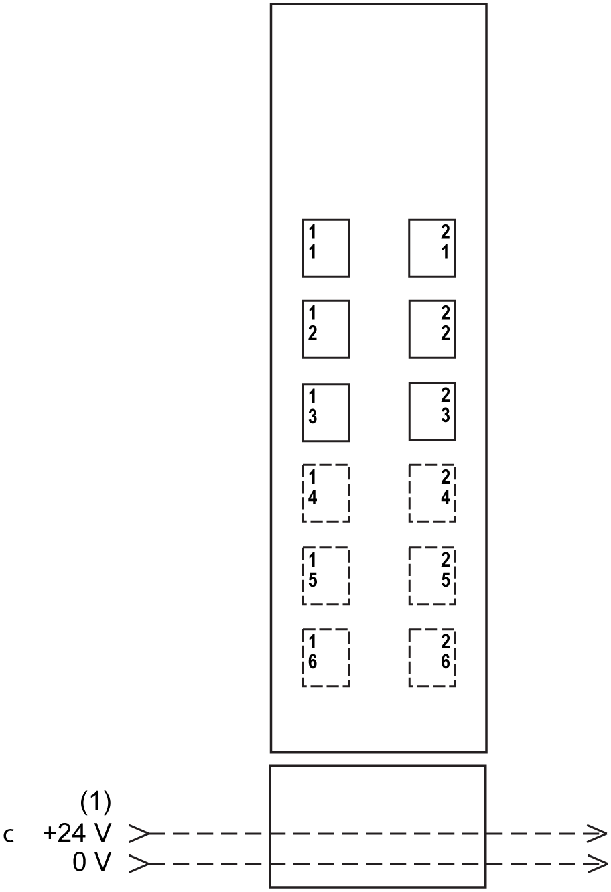

# TM5SD000 Dummy Module

## General Information

TM5SD000 dummy module is a non-functional module. This module is used as a place holder for later system expansion according to the [TM5 association table](D-SE-0015409.html#D-SE-0015409).

## Ordering Information

The following figure shows a slice with the TM5SD000 dummy module:

| Number | Reference | Description | Color |
| --- | --- | --- | --- |
| 1 | TM5ACBM11  or  TM5ACBM15 | Bus base  Bus base with address setting | White  White |
| 2 | TM5DSD000 | Dummy module | White |
| 3 | TM5ACTB06  or  TM5ACTB12 | Terminal block, 6-pin  Terminal block, 12-pin | White  White |

## General Characteristics

The characteristics of the TM5SD000 dummy module are described in [environmental characteristics](D-SE-0015384.html#D-SE-0015384).

## Wiring Diagram

**1** 24 Vdc I/O power segment integrated into the bus bases

EIO0000001058.04

© 2020

Schneider Electric.

All rights reserved.