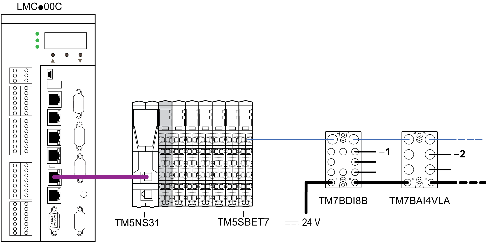

# Sensor Cables

## Overview

The sensor cables are used to:

* Connect the sensors to the analog inputs of the TM7 I/O blocks
* Connect the actuators to the analog outputs of the TM7 I/O blocks
* Connect the fast digital signals to the fast inputs or outputs of the TM7 I/O blocks

The following figure shows sensor cables used in TM5/TM7 configurations:

**1** Sensor cable for TM7 Sercos III Bus Interface I/O block and TM7 digital I/O block

**2** Sensor cable for TM7 analog I/O block

## Ordering Information

| Length | Short Description, Reference | | | |
| --- | --- | --- | --- | --- |
| M 12 Cable for Analog I/O | | M 12 Cable for Digital I/O | M 8 Cable for Digital I/O |
| 0.5 m (1.6 ft) | – | – | XZ CP1564L05 | XZ CP2737L05 |
| 1 m (3.3 ft) | – | – | XZ CP1564L1 | XZ CP2737L1 |
| 2 m (6.6 ft) | TCSXCN2M2SA | TCSXCN1M2SA | XZ CP1564L2 | XZ CP2737L2 |
| 5 m (16.4 ft) | TCSXCN2M5SA | TCSXCN1M5SA | – | – |
| 15 m (49.2 ft) | TCSXCN2M15SA | TCSXCN1M15SA | – | – |
| **Dimensions and Pin Assignment** | [TCSXCN2M••SA](#D-SE-0009909__D-SE-0009909.5) | [TCSXCN1M••SA](#D-SE-0009909__D-SE-0009909.6) | [XZ CP1564L••](#D-SE-0009909__D-SE-0009909.9) | [XZ CP2737L••](#D-SE-0009909__D-SE-0009909.10) |

## TCSXCN2M••SA and TCSXCN1M••SA Cable Characteristics

The table below describes the characteristics of the individual wire of the cable:

| Characteristics | Specifications |
| --- | --- |
| Conductor cross section (gauge) | 0.34 mm2 (AWG 22) |
| Material insulation | Polypropylene (PP) |
| Material filler | Polyethylene (PE) |
| Core diameter including insulation | 1.27 mm (0.05 in.) ± 0.02 mm (0.0008 in.) |
| Electrical resistance (at 20 °C (68 °F)) | ≤ 0.058 Ω/m (0.018 Ω/ft) |
| Insulation resistance (at 20 °C (68 °F)) | ≥ 100 GΩ\*km (328 TΩ\*ft) |
| Nominal voltage | 300 V |
| Test voltage conductor | 3000 Vdc x 1 s |

The table below describes the general characteristics of the cable:

| Characteristics | | Specification |
| --- | --- | --- |
| Cable type | | Special PUR black shielded |
| Conductor material | | Bare Cu litz wires |
| Shield | | Braided copper wires |
| External cable diameter | | 5.9 mm (0.23 in.) |
| Minimum curve radius | | 59 mm (2.32 in.) |
| Wire colors | | Brown, white, blue, black, gray |
| External sheath, color | | Black-gray RAL 7021 |
| Cable weight | | 48 kg/km (1.55 lb/ft) |
| Number of bending cycles | | 4 million |
| Traversing path | | 10 m (32.8 ft) |
| Traversing rate | | 3 m/s (9.8 ft/s) |
| Acceleration | | 10 m/s2 (32.8 ft/s2) |
| M12 fastening torque | | Maximum 0.4 Nm (3.5 lbf-in) |

The following table lists the environmental characteristics of the cable:

| Characteristics | Specification |
| --- | --- |
| Operating temperature | – 5...80 °C (23...176 °F) |
| Storage temperature | – 40...80 °C (– 40...176 °F) |
| Special properties | Flexible cable conduit capable |
| Silicone-free |
| Free of substances which would hinder coating with paint or varnish |
| Flame resistance | As per UL-Style 20549 |
| Freedom from halogen | As per DIN VDE 0472 part 815 |
| Resistance to oil | Complying with DIN EN 60811-2-1 |
| Other resistance | Resistant to acids, alkaline solutions and solvents |
| Hydrolysis and microbe resistant |
| WEEE/RoHS | Compliant |

## XZ CP1564L•• Cable Characteristics

The following table describes the characteristics of the individual wire of the cable:

| Characteristics | Specifications |
| --- | --- |
| Conductor cross section (gauge) | 4 x 0.34 mm2 (AWG 22) and 1 x 0.5 mm2 (AWG 20) |
| Material insulation | PVC |
| Insulation resistance (at 20 °C (68 °F)) | > 1 GΩ |
| Nominal current | 4 A |
| Nominal voltage | 30 Vac, 36 Vdc |
| Contact resistance | ≤ 5 mΩ |
| Insulation voltage | 2500 Vdc |

The following table lists the general characteristics of the cable:

| Characteristics | | Specification |
| --- | --- | --- |
| Cable type | | Special PUR black shielded |
| External cable diameter | | 5.2 mm (0.20 in.) |
| Minimum curve radius | | 52 mm (2.05 in.) |
| Wire colors | | Brown, black/white, blue, black, yellow/green |
| External sheath, color | | Black |
| Cable weight | XZ CP1564L05 | 0.040 kg (0.09 lb) |
| XZ CP1564L1 | 0.065 kg (0.14 lb) |
| XZ CP1564L2 | 0.115 kg (0.25 lb) |
| Tensile strength | | 20...45 N/mm2 (2901...6527 lbf/in2) |
| M12 fastening torque | | Maximum 0.4 Nm (3.5 lbf-in) |

The following table lists the environmental characteristics of the cable:

| Characteristics | Specification |
| --- | --- |
| Operating temperature | –5...90 °C (23...194 °F) |
| Storage temperature | –35...100 °C (–31...212 °F) |
| Special properties | Flexible cable conduit capable |
| Silicone-free |
| Without unmoulding agent |
| Flame resistance | C2 conforming to NF C 32-070 |
| Freedom from halogen | As per DIN VDE 0472 part 815 |
| Other resistance | Resistant to soluble, mineral or synthetic oil at 90 °C (194 °F) |
| WEEE/RoHS | Compliant |

## XZ CP2337L•• Cable Characteristics

The following table describes the characteristics of the individual wire of the cable:

| Characteristics | Specifications |
| --- | --- |
| Conductor cross section (gauge) | 0.34 mm2 (AWG 22) |
| Material insulation | PVC |
| Insulation resistance (at 20 °C (68 °F)) | > 1 GΩ |
| Nominal current | 4 A |
| Nominal voltage | 60 Vac, 75 Vdc |
| Contact resistance | ≤ 5 mΩ |
| Insulation voltage | 2500 Vdc |

The following table lists the general characteristics of the cable:

| Characteristics | | Specification |
| --- | --- | --- |
| Cable type | | Special PUR black shielded |
| External cable diameter | | 5.2 mm (0.20 in.) |
| Minimum curve radius | | 52 mm (2.05 in.) |
| Wire colors | | Brown, blue, black |
| External sheath, color | | Black |
| Cable weight | XZ CP2737L05 | 0.030 kg (0.07 lb) |
| XZ CP2737L1 | 0.050 kg (0.11 lb) |
| XZ CP2737L2 | 0.080 kg (0.18 lb) |
| Tensile strength | | 20...45 N/mm2 (2901...6527 lbf.in2) |
| M8 fastening torque | | Maximum 0.2 Nm (1.8 lbf-in) |

The following table lists the environmental characteristics of the cable:

| Characteristics | Specification |
| --- | --- |
| Operating temperature | –5...90 °C (23...194 °F) |
| Storage temperature | –35...100 °C (–31...212 °F) |
| Special properties | Flexible cable conduit capable |
| Silicone-free |
| Without unmoulding agent |
| Flame resistance | C2 conforming to NF C 32-070 |
| Freedom from halogen | As per DIN VDE 0472 part 815 |
| Other resistance | Resistant to soluble, mineral or synthetic oil at 90 °C (194 °F) |
| WEEE/RoHS | Compliant |

## TCSXCN2M••SA Dimensions and Pin Assignment

| Dimensions | | | |
| --- | --- | --- | --- |
|  | | | |
| **L** length as a function of the particular reference | | | |

| Pin Assignment | | | |
| --- | --- | --- | --- |
| Male Connector | Pin | Designation | Wire Color |
|  | 1 | For pin assignment, refer to the wiring diagrams of the [Modicon TM7 Analog I/O Blocks Hardware Guide](../../../../../api/crossBook?lang=en-US&virtualBookName=tm7aiohw&topicID=D_SE_0007625). | Brown |
| 2 | White |
| 3 | Blue |
| 4 | Black |
| 5 | Gray |
| M121 | SHLD |
| **1** Shielding 360 ° around M12 knurled screw | | | |

## TCSXCN1M••SA Dimensions and Pin Assignment

| Dimensions | | | |
| --- | --- | --- | --- |
|  | | | |
| **L** length as a function of the particular reference | | | |

| Pin Assignment | | | |
| --- | --- | --- | --- |
| Male Connector | Pin | Designation | Wire Color |
|  | 1 | For pin assignment, refer to the wiring diagrams of the [Modicon TM7 Analog I/O Blocks Hardware Guide](../../../../../api/crossBook?lang=en-US&virtualBookName=tm7aiohw&topicID=D_SE_0007625). | Brown |
| 2 | White |
| 3 | Blue |
| 4 | Black |
| 5 | Gray |
| M121 | SHLD |
| **1** Shielding 360 ° around M12 knurled screw | | | |

## XZ CP1564L•• Dimensions and Pin Assignment

| Dimensions | | | |
| --- | --- | --- | --- |
|  | | | |
| **L** length as a function of the particular reference | | | |

| Pin Assignment | | | |
| --- | --- | --- | --- |
| Male Connector | Pin | Designation | Wire Color |
|  | 1 | For pin assignment, refer to the wiring diagrams of the [Modicon TM7 Digital I/O Blocks Hardware Guide](../../../../../api/crossBook?lang=en-US&virtualBookName=tm7diohw&topicID=D_SE_0008132). | Brown |
| 2 | Black / White |
| 3 | Blue |
| 4 | Black |
| 5 | Yellow / Green |

## XZ CP2737L•• Dimensions and Pin Assignment

| Dimensions | | | |
| --- | --- | --- | --- |
|  | | | |
| **L** length as a function of the particular reference | | | |

| Pin Assignment | | | |
| --- | --- | --- | --- |
| Male Connector | Pin | Designation | Wire Color |
|  | 1 | For pin assignment, refer to the wiring diagrams of the [Modicon TM7 Digital I/O Blocks Hardware Guide](../../../../../api/crossBook?lang=en-US&virtualBookName=tm7diohw&topicID=D_SE_0008132). | Brown |
| 3 | Blue |
| 4 | Black |

EIO0000001058.04

© 2020

Schneider Electric.

All rights reserved.