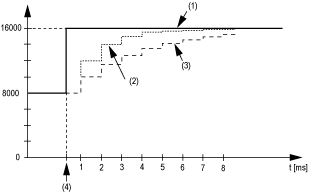

# Filter Level

Filter Level

The input value is evaluated according to the filter level. An input limitation can then be applied using this evaluation.

Formula for the evaluation of the input value:

The following examples show the function of the input limitation based on an input jump and a disturbance.

Example 1: The input value makes a jump from 8000 to 16000. The diagram displays the evaluated value with the following settings:

Input limitation = 0

Filter level = 2 or 4

1   Input value

2   Evaluated value: Filter level 2

3   Evaluated value: Filter level 4

4   Input jump

Example 2: A disturbance is imposed on the input value. The diagram shows the evaluated value with the following settings:

Input limitation = 0

Filter level = 2 or 4

1   Input value

2   Evaluated value: Filter level 2

3   Evaluated value: Filter level 4

4   Disturbance (Spike)