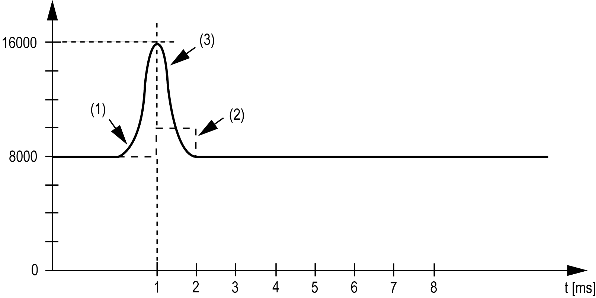

# Input Limitation

Input Limitation

Input limitation can only take place when a filter is used. Input limitation is executed before filtering takes place.

The amount of the change in the input value is checked to make sure the specified limits are not exceeded. If the values are exceeded, the adjusted input value is equal to the old value ± the limit value.

The input limitation is well suited for suppressing disturbances (spikes). The following examples show the function of the input limitation based on an input jump and a disturbance.

Example 1: The input value makes a jump from 8000 to 17000. The diagram displays the adjusted input value for the following settings:

Input limitation = 2047

Filter level = 2

1   Input value

2   Internal adjusted input value before filter

3   Input jump

Example 2: A disturbance is imposed on the input value. The diagram shows the adjusted input value with the following settings:

Input limitation = 2047

Filter level = 2

1   Input value

2   Internal adjusted input value before filter

3   Disturbance (Spike)