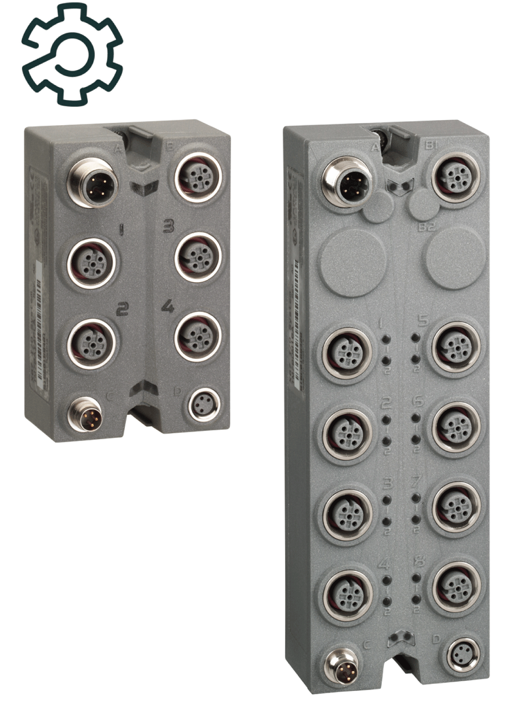

# TM7 Expansion Blocks Configuration - Programming Guide

TM7 Expansion Blocks Configuration - Programming Guide

TM7 Expansion Blocks Configuration - Programming Guide

This manual describes the configuration of the Modicon TM7 Input/Output expansion blocks. For further information, refer to the separate documents provided in the EcoStruxure Machine Expert online help.

EIO0000003233.00

© 2019 Schneider Electric. All rights reserved.