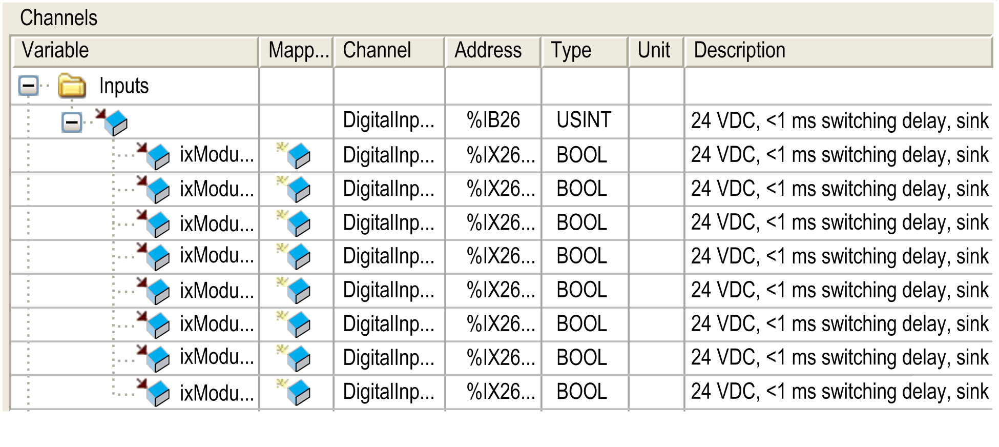

# Adding an Expansion Block

Adding an Expansion Block

Procedure

To add an expansion block to your controller, select the expansion block in the Hardware Catalog, drag it to the Devices tree, and drop it on one of the highlighted nodes.

For more information on adding a device to your project, refer to:

• Using the [Drag-and-drop Method](../../../../../../api/crossBook?lang=en-US&virtualBookName=SoMProg&topicID=D_SE_0083368_1)

• Using the [Contextual Menu or Plus Button](../../../../../../api/crossBook?lang=en-US&virtualBookName=SoMProg&topicID=D_SE_0083370_1)

I/O Configuration

| Step | Action |
| --- | --- |
| 1 | Select the Devices tree tab. |
| 2 | Double-click the expansion block node.  Result: The TM7 Module I/O Mapping tab of the block appears. |

TM7 Module I/O Mapping Tab Description

Variables can be defined and named in the I/O Mapping tab. Additional information such as topological addressing is also provided in this tab:

The I/O Mapping tab contains the following columns:

| Column | Description |
| --- | --- |
| Variable | Lets you map the channel on a variable.  Double-click the icon to enter the variable name.  If it is a new variable, the variable is created.  It is also possible to map an existing variable from the Variables tab of the Software Catalog by a drag-and-drop action. |
| Mapping | Indicates if the channel is mapped on a new variable or an existing variable. |
| Channel | Name of the channel of the device. |
| Address | Address of the channel. |
| Type | Data type of the channel. |
| Unit | Unit of the channel value. |
| Description | Description of the channel. |

NOTE: %I value is updated from physical information at the beginning of each task using the %I.

Physical output level is updated from memory variable for the outputs value within the task configured by Bus cycle task configuration.

For more details on Bus cycle task, refer to [Logic Controller PLC Settings](../../../../../../api/crossBook?lang=en-US&virtualBookName=m258prg&topicID=D_SE_0006801_1) or [Motion Controller PLC Settings](../../../../../../api/crossBook?lang=en-US&virtualBookName=lmcprg&topicID=D_SE_0006801_3).

User-Defined Parameters Tab Description

The User-Defined Parameters tab allows you to configure the expansion module.

Click Defaults to reset the values to the original values.

EIO0000003233.00

© 2019 Schneider Electric. All rights reserved.