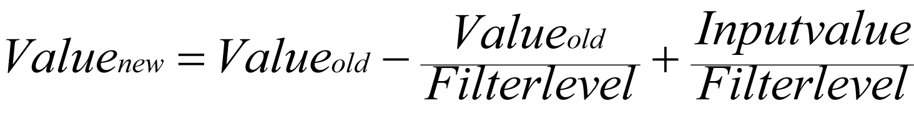
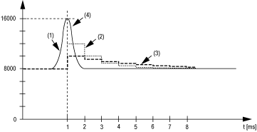
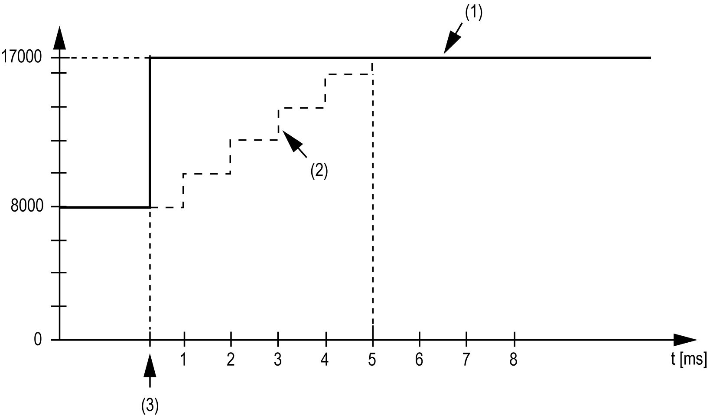

# TM7BAM4VLA

TM7BAM4VLA

Introduction

The TM7BAM4VLA expansion block is a 2 analog input block with 10 Vdc inputs and 2 analog output block with 10 Vdc outputs.

For further information, refer to TM7BAM4VLA Block 2AI/2AO ±10V.

TM7 Module I/O Mapping Tab

Variables can be defined and named in the TM7 Module I/O Mapping tab. Additional information such as topological addressing is also provided in this tab.

This table describes the I/O Mapping configuration:

| Variable | Channel | Type | Description |
| --- | --- | --- | --- |
| – | ModuleOK | BYTE | State of the compact I/O and electronic modules |
| DiagIn | BYTE | Status bit associated to each I/O:  o0: OK  o1: Error detected |
| Inputs | AnalogInput 1-2 0 | INT | Current value of the input 0 |
| AnalogInput 1-2 1 | Current value of the input 1 |
| Outputs | AnalogOutput 3-4 0 | INT | Command word of the output 0 |
| AnalogOutput 3-4 1 | Command word of the output 1 |

For further generic descriptions, refer to [I/O Mapping Tab Description](../TM7_I_O_Blocks_Overview/TM7_I_O_Blocks_Overview-3.htm#XREF_D_SE_0011130_1).

Filter Level

The input value is evaluated according to the filter level. An input limitation can then be applied using this evaluation.

Formula for the evaluation of the input value:

The following examples show the function of the input limitation based on an input jump and a disturbance.

Example 1: The input value makes a jump from 8000 to 16000. The diagram displays the evaluated value with the following settings:

Input limitation = 0

Filter level = 2 or 4

1   Input value

2   Evaluated value: Filter level 2

3   Evaluated value: Filter level 4

4   Input jump

Example 2: A disturbance is imposed on the input value. The diagram shows the evaluated value with the following settings:

Input limitation = 0

Filter level = 2 or 4

1   Input value

2   Evaluated value: Filter level 2

3   Evaluated value: Filter level 4

4   Disturbance (Spike)

Input Limitation

Input limitation can only take place when a filter is used. Input limitation is executed before filtering takes place.

The amount of the change in the input value is checked to make sure the specified limits are not exceeded. If the values are exceeded, the adjusted input value is equal to the old value ± the limit value.

The input limitation is well suited for suppressing disturbances (spikes). The following examples show the function of the input limitation based on an input jump and a disturbance.

Example 1: The input value makes a jump from 8000 to 17000. The diagram displays the adjusted input value for the following settings:

Input limitation = 2047

Filter level = 2

1   Input value

2   Internal adjusted input value before filter

3   Input jump

Example 2: A disturbance is imposed on the input value. The diagram shows the adjusted input value with the following settings:

Input limitation = 2047

Filter level = 2

1   Input value

2   Internal adjusted input value before filter

3   Disturbance (Spike)

User-Defined Parameters Tab

The table describes the user-defined parameters of the module:

| Parameter | Value | Default Value | Description |
| --- | --- | --- | --- |
| InputFilter | off  Level 2  Level 4  Level 8  Level 16  Level 32  Level 64  Level 128 | off | Definition of the [filter level](TM7_Analog_I_O_Blocks-2.htm#XREF_D_SE_0011090_18). |
| InputLimitation | off  4095  511  8191  1023  16383  2047  255 | 16383 | Specifies the limitation of [input ramp](TM7_Analog_I_O_Blocks-2.htm#XREF_D_SE_0011090_19).  NOTE: Parameter only available if an i[nput filter](../glossary/glossary.htm#XREF_D_SE_0024697_291) is selected. |

EIO0000003233.00

© 2019 Schneider Electric. All rights reserved.