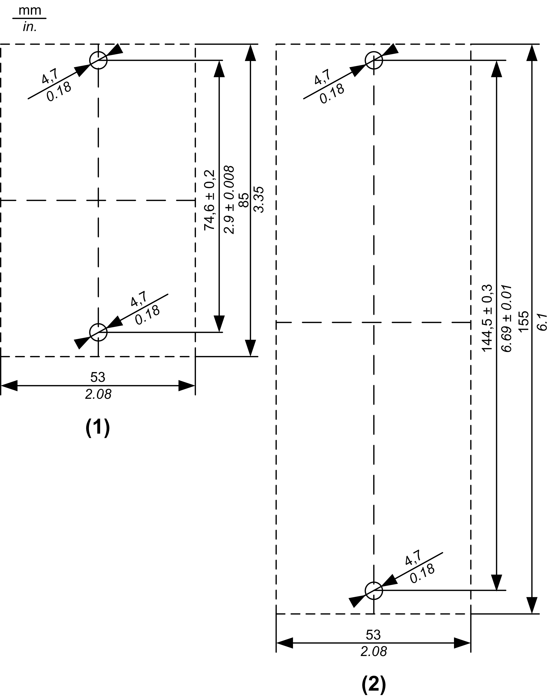
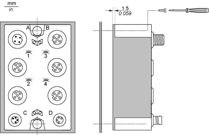

# TM7 Block Directly on the Machine

TM7 Block Directly on the Machine

The TM7 block can be mounted to any bare-metal surface of the machine, provided that the surface is [properly grounded](../../../../../../api/crossBook?lang=en-US&virtualBookName=m258pig&topicID=D_SE_0002601_1). To mount the block directly on the machine, the following figure gives the drilling template of the blocks:

(1)   Size 1 block

(2)   Size 2 block

The thickness of the base plate should be taken into consideration when defining the screw length.

NOTE: Maximum torque to fasten the required M4 screws is  0.6 Nm (5.3 lbf-in).

|  |
| --- |
| NOTICE |
| INOPERABLE EQUIPMENT |
| oEnsure that the block is securely affixed to its mounting surface.  oDo not tighten screws beyond the specified maximum torque. |
| Failure to follow these instructions can result in equipment damage. |