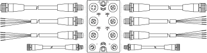

# General View of a TM7 I/O Block and Cables

General View of a TM7 I/O Block and Cables

The following figure shows a TM7 I/O block and associated cables:

| Item | TM7 Cable Type | TM7 Block Connector |
| --- | --- | --- |
| A | Expansion bus drop cable | TM7 bus IN |
| B | Expansion bus drop cable | TM7 bus OUT |
| 1...4 | Sensor or actuator cable | I/O connectors |
| C | Power drop cable | 24 Vdc power IN connector |
| D | Power drop cable | 24 Vdc power OUT connector |

|  |
| --- |
| Warning_Color.gifWARNING |
| IP67 NON-CONFORMANCE |
| oProperly fit all connectors with cables or sealing plugs and tighten for IP67 conformance according to the torque values as specified in this document.  oDo not connect or disconnect cables or sealing plugs in the presence of water or moisture. |
| Failure to follow these instructions can result in death, serious injury, or equipment damage. |

|  |
| --- |
| NOTICE |
| ELECTROSTATIC DISCHARGE |
| oDo not touch the pin connectors of the block.  oKeep the cables or sealing plugs in place during normal operation. |
| Failure to follow these instructions can result in equipment damage. |