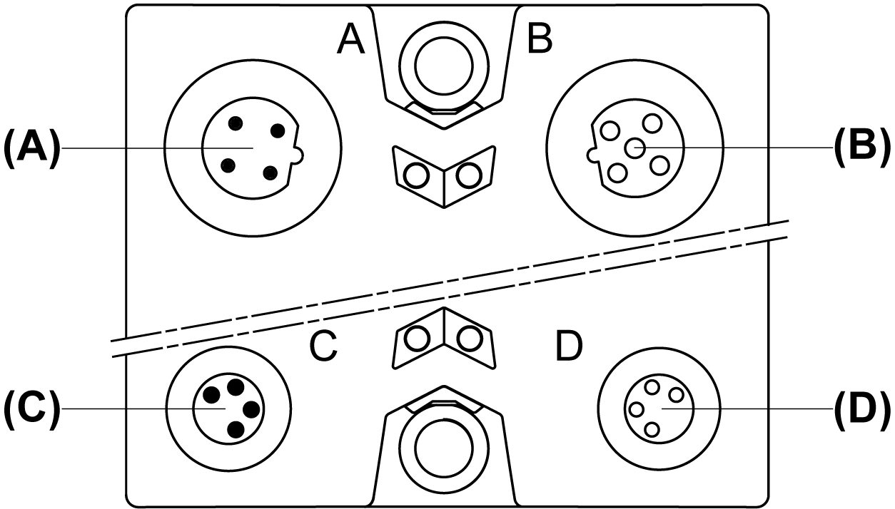

# TM7 I/O Blocks Pin and Connector Assignments

TM7 I/O Blocks Pin and Connector Assignments

The following figure shows the connector assignments of a TM7 I/O block:

(A)   TM7 bus IN connector M12

(B)   TM7 bus OUT connector M12

(C)   24 Vdc power IN connector M8

(D)   24 Vdc power OUT connector M8

The following figure shows the pin assignments of the TM7 bus IN (A) and OUT (B) connectors:

| Connection | Pin | Designation |
| --- | --- | --- |
| G-SE-0006160.1.gif | 1 | TM7 V+ |
| 2 | TM7 Bus Data |
| 3 | TM7 0 Vdc |
| 4 | TM7 Bus Data |
| 5 | N.C. |

The following figure shows the pin assignments of the 24 Vdc power IN (C) and OUT (D) connectors:

| Connection | Pin | Designation |
| --- | --- | --- |
| G-SE-0006446.1.gif | 1 | 24 Vdc I/O power segment |
| 2 | 24 Vdc I/O power segment |
| 3 | 0 Vdc |
| 4 | 0 Vdc |

NOTE:

oThe status of the LEDs are provided in the Presentation section of each I/O block.

oThe pin assignments of the I/O connectors are provided in the Wiring Diagram section of each I/O block.