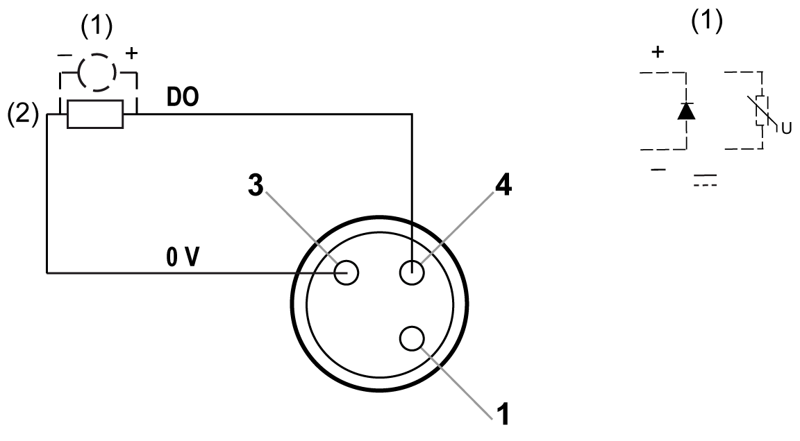
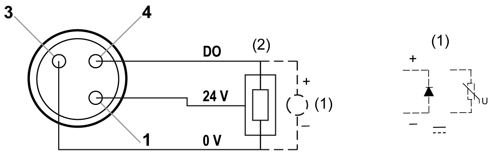

# Wiring Diagram

Wiring Diagram

The following figures show the wiring diagram for the output connectors of the TM7BDO8TAB block:

(1)   Inductive load protection

(2)   2-wire load

(1)   Inductive load protection

(2)   3-wire load

|  |
| --- |
| NOTICE |
| INOPERABLE EQUIPMENT |
| Do not use an external power supply for actuators. |
| Failure to follow these instructions can result in equipment damage. |