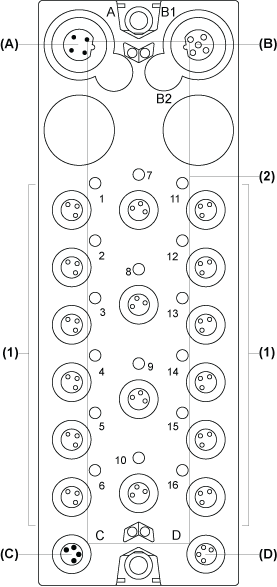

# Description

Description

The following figure shows the TM7BDM16B block:

(A)   TM7 bus IN connector

(B)   TM7 bus OUT connector

(C)   24 Vdc power IN connector

(D)   24 Vdc power OUT connector

(1)   Input / Output connectors

(2)   Status LEDs