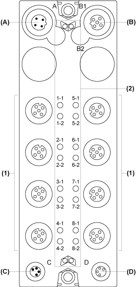
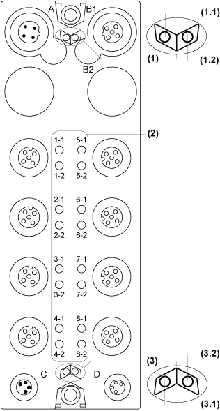

# TM7BDI16A Presentation

TM7BDI16A Presentation

Main Characteristics

The table below provides the main characteristics of the TM7BDI16A block:

| Main characteristics | | |
| --- | --- | --- |
| Number of input channels | | 16 |
| Input type | | Type 1 |
| Signal type | | Sink |
| Rated input voltage | | 24 Vdc |
| Sensor connection type | | M12, [female connector type](TM7_Digital_-_TM7BDI16x_Digital_Input_Module-9.htm#XREF_D_SE_0008151_1) |

Description

The following figure shows the TM7BDI16A block:

(A)   TM7 bus IN connector

(B)   TM7 bus OUT connector

(C)   24 Vdc power IN connector

(D)   24 Vdc power OUT connector

(1)   Input connectors

(2)   Status LEDs

Connector and Channel Assignments

The table below provides the connector and channel assignments of the TM7BDI16A block:

| Input connectors | [Status LEDs](#XREF_D_SE_0008149_6) | Channel type | Channels |
| --- | --- | --- | --- |
| 1 | 1-1 | Input | I0 |
| 1-2 | Input | I1 |
| 2 | 2-1 | Input | I2 |
| 2-2 | Input | I3 |
| 3 | 3-1 | Input | I4 |
| 3-2 | Input | I5 |
| 4 | 4-1 | Input | I6 |
| 4-2 | Input | I7 |
| 5 | 5-1 | Input | I8 |
| 5-2 | Input | I9 |
| 6 | 6-1 | Input | I10 |
| 6-2 | Input | I11 |
| 7 | 7-1 | Input | I12 |
| 7-2 | Input | I13 |
| 8 | 8-1 | Input | I14 |
| 8-2 | Input | I15 |

Status LEDs

The following figure shows the status LEDs of the TM7BDI16A block:

1   TM7 bus status LEDs, set of two LEDs: 1.1 (green) and 1.2 (red)

2   Channel LEDs, composed of eight sets of two LEDs: 1-1 to 8-2 (green)

3   Block status LEDs, set of two LEDs: 3.1 (green) and 3.2 (red)

The table below provides the TM7 bus status LEDs of the TM7BDI16A block:

| TM7 bus status LEDs | | Description |
| --- | --- | --- |
| LED 1.1 | LED 1.2 |
| OFF | OFF | No power supply on TM7 bus |
| ON | ON | TM7 bus in preoperational state:  opower supply on TM7 bus and  oblock not initialized |
| ON | OFF | TM7 bus in operational state |
| OFF | ON | TM7 bus error detected |

The table below provides the input status LEDs of the TM7BDI16A block:

| Channel LEDs | State | Description |
| --- | --- | --- |
| 1-1 to 8-2 | OFF | Corresponding input deactivated |
| 1-1 to 8-2 | ON | Corresponding input activated |

The table below provides the input block status LEDs of the TM7BDI16A block:

| Block status LEDs | State | Description |
| --- | --- | --- |
| 3.1 | OFF | No power supply |
| Single Flash | Reset state |
| Flashing | Preoperational state |
| ON | Operational state |
| 3.2 | OFF | OK or no power supply |
| ON | Detected error or reset state |

EIO0000003239.01

© 2020 Schneider Electric. All rights reserved.