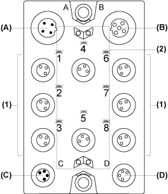
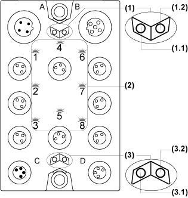

# TM7BDO8TAB Presentation

TM7BDO8TAB Presentation

Main Characteristics

The table below provides the main characteristics of the TM7BDO8TAB block:

| Main characteristics | | |
| --- | --- | --- |
| Number of output channels | | 8 |
| Output type | | Transistor, 2 A max. |
| Signal type | | Source |
| Rated output voltage | | 24 Vdc |
| Sensor connection type | | M8, [female connector type](TM7_Digital_-_TM7BDO8TAB_Digital_Output_Module-4.htm#XREF_D_SE_0008157_1) |

Description

The following figure shows the TM7BDO8TAB block:

(A)   TM7 bus IN connector

(B)   TM7 bus OUT connector

(C)   24 Vdc power IN connector

(D)   24 Vdc power OUT connector

(1)   Output connectors

(2)   Status LEDs

Connector and Channel Assignments

The table below provides the connector and channel assignments of the TM7BDO8TAB block:

| Output connectors | [Status LEDs](#XREF_D_SE_0008155_6) | Channel type | Channels |
| --- | --- | --- | --- |
| 1 | 1 | Output | Q0 |
| 2 | 2 | Output | Q1 |
| 3 | 3 | Output | Q2 |
| 4 | 4 | Output | Q3 |
| 5 | 5 | Output | Q4 |
| 6 | 6 | Output | Q5 |
| 7 | 7 | Output | Q6 |
| 8 | 8 | Output | Q7 |

Status LEDs

The following figure shows the status LEDs of the TM7BDO8TAB block:

1   TM7 bus status LEDs, set of two LEDs: 1.1 (green) and 1.2 (red)

2   Channel LEDs, composed of eight LEDs (orange)

3   Block status LEDs, set of two LEDs: 3.1 (green) and 3.2 (red)

The table below provides the TM7 bus status LEDs of the TM7BDO8TAB block:

| TM7 bus status LEDs | | Description |
| --- | --- | --- |
| LED 1.1 | LED 1.2 |
| OFF | OFF | No power supply on TM7 bus |
| ON | ON | TM7 bus in preoperational state:  opower supply on TM7 bus and  oblock not initialized |
| ON | OFF | TM7 bus in operational state |
| OFF | ON | TM7 bus error detected |

The table below provides the output status LEDs of the TM7BDO8TAB block:

| Channel LEDs | State | Description |
| --- | --- | --- |
| 1 to 8 | OFF | Corresponding output deactivated |
| 1 to 8 | ON | Corresponding output activated |

The table below provides the output block status LEDs of the TM7BDO8TAB block:

| Block status LEDs | State | Description |
| --- | --- | --- |
| 3.1 | OFF | No power supply |
| Single Flash | Reset state |
| Flashing | Preoperational state |
| ON | Operational state |
| 3.2 | OFF | OK or no power supply |
| ON | Detected error or reset state |
| Single Flash | Detected error on an output channel |

EIO0000003239.01

© 2020 Schneider Electric. All rights reserved.