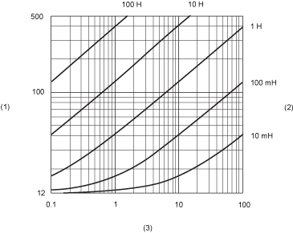

# TM7BDO8TAB Characteristics

TM7BDO8TAB Characteristics

General Characteristics

|  |
| --- |
| Danger_Color.gifDANGER |
| POTENTIAL FOR EXPLOSION |
| oOnly use this equipment in non-hazardous locations or in locations that comply either with the Class I, Division 2, Groups A, B, C and D, or with the ATEX Group II, Zone 2 specifications for hazardous locations, depending on your local and/or national regulations.  oDo not substitute components which would impair compliance to the hazardous location specifications of this equipment.  oDo not connect or disconnect equipment unless power has been removed or the location is known to be non-hazardous. |
| Failure to follow these instructions will result in death or serious injury. |

NOTE: Additional equipment used in conjunction with the equipment described herein must also be suitable for the operating location.

|  |
| --- |
| Danger_Color.gifDANGER |
| FIRE HAZARD |
| Use cable sizes that meet the I/O channel and power supply voltage and current ratings. |
| Failure to follow these instructions will result in death or serious injury. |

|  |
| --- |
| Warning_Color.gifWARNING |
| UNINTENDED EQUIPMENT OPERATION |
| Do not exceed any of the rated values specified in the environmental and electrical characteristics tables. |
| Failure to follow these instructions can result in death, serious injury, or equipment damage. |

The table below provides the general characteristics of the TM7BDO8TAB block:

| General characteristics | |
| --- | --- |
| Rated power supply voltage | 24 Vdc |
| Power supply range | 18...30 Vdc |
| 24 Vdc I/O power segment current draw | 84 mA |
| TM7 power bus current draw | 34 mA |
| Power dissipation | 3.8 W max. |
| Weight | 185 g (6.52 oz.) |
| ID code | 5223 dec |

See also [Environmental Characteristics](../TM7_Implementing_Rules/TM7_Implementing_Rules-4.htm#XREF_D_SE_0007646_1).

Output Characteristics

The table below provides the output characteristics of the TM7BDO8TAB block:

| Output characteristics | | |
| --- | --- | --- |
| Number of output channels | 8 (in 2 groups: Q0 to Q3 and Q4 to Q7) | |
| Wiring type | 2 or 3 wires | |
| Connection type | M8, female connector, 3-pin | |
| Rated output voltage | 24 Vdc | |
| Output voltage range | 18...30 Vdc | |
| Output current | 2 A max. per output | |
| Voltage drop | 0.5 Vdc max. at 2 A rated current | |
| Total output current per group | 4 A max. | |
| Total output current for the block | 8 A max. | |
| Leakage current when switched off | 5 µA | |
| Output signal type | Source | |
| Turn on time | 250 µs max. | |
| Turn off time | 270 µs max. | |
| Switching frequency | Resistive load | 100 Hz Max. |
| Inductive load | See the [switching inductive load characteristics](#XREF_D_SE_0008156_6) |
| Breaking voltage when switching off inductive loads | Typically 50 Vdc | |
| Short circuit peak current | 21 A max. | |
| Isolation between channels | Not isolated | |
| Isolation between channels and bus | See note 1 | |
| Protection | Reverse polarity protection | |
| Output protection | Against short-circuit and overcurrent, thermal protection | |
| Automatic rearming after short circuit or overcurrent | Yes, 10 ms minimum depending on the internal temperature | |

1 The isolation of the block is 500 Vac RMS between the electronics powered by the TM7 power bus and those powered by the 24 Vdc I/O power segment connected to the block. In practice, there is a bridge between the TM7 power bus and the 24 Vdc I/O power segment. The two power circuits reference the same functional ground (FE) through specific components designed to reduce effects of electromagnetic interference. These components are rated at 30 Vdc or 60 Vdc. This effectively reduces isolation of the entire system from the 500 Vac RMS.

Actuator Supply

The table below provides the power supply for the actuators of the TM7BDO8TAB block:

| Supply | |
| --- | --- |
| Voltage | 24 Vdc I/O power segment supply less voltage drop for internal protection. |
| Voltage drop for internal protection at 500 mA | 2 Vdc max. |
| Supply current (for all powered connected actuators) | 500 mA max. |
| Internal protection | Overcurrent and short circuit |

Switching Inductive Load Characteristics

The following figure shows the switching inductive loads characteristics of the TM7BDO8TAB block:

(1)   Load resistance in Ω

(2)   Load inductance in H

(3)   Max. operating cycles / second

EIO0000003239.01

© 2020 Schneider Electric. All rights reserved.