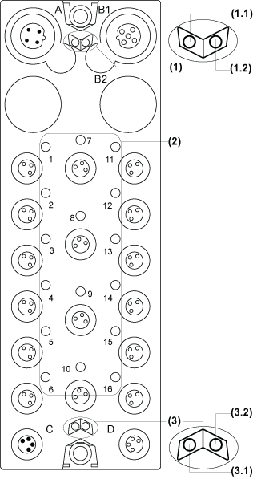

# TM7BDM16B Presentation

TM7BDM16B Presentation

Main Characteristics

The table below provides the main characteristics of the TM7BDM16B block:

| Main characteristics | | |
| --- | --- | --- |
| Number of input/output channels | 16 | |
| Input type | Type 1 | |
| Input signal type | Sink | |
| Output type | Transistor, 0.5 A max. | |
| Output signal type | Source | |
| Sensor and actuator connection type | M8, female [connector type](TM7BDM16x_Digital_Mixed_Modules-9.htm#XREF_D_SE_0008676_3) | |

Description

The following figure shows the TM7BDM16B block:

(A)   TM7 bus IN connector

(B)   TM7 bus OUT connector

(C)   24 Vdc power IN connector

(D)   24 Vdc power OUT connector

(1)   Input / Output connectors

(2)   Status LEDs

Connector and Channel Assignments

The table below provides the connector and channel assignments of the TM7BDM16B block. For further information, refer to [I/O Configuration Tab](../../../../../../api/crossBook?lang=en-US&virtualBookName=tm7prg&topicID=D_SE_0011087_5):

| I/O connectors | I/O status LEDs | Channel types | Channels |
| --- | --- | --- | --- |
| 1 | 1 | Input / Output | I0 / Q0 |
| 2 | 2 | Input / Output | I1 / Q1 |
| 3 | 3 | Input / Output | I2 / Q2 |
| 4 | 4 | Input / Output | I3 / Q3 |
| 5 | 5 | Input / Output | I4 / Q4 |
| 6 | 6 | Input / Output | I5 / Q5 |
| 7 | 7 | Input / Output | I6 / Q6 |
| 8 | 8 | Input / Output | I7 / Q7 |
| 9 | 9 | Input / Output | I8 / Q8 |
| 10 | 10 | Input / Output | I9 / Q9 |
| 11 | 11 | Input / Output | I10 / Q10 |
| 12 | 12 | Input / Output | I11 / Q11 |
| 13 | 13 | Input / Output | I12 / Q12 |
| 14 | 14 | Input / Output | I13 / Q13 |
| 15 | 15 | Input / Output | I14 / Q14 |
| 16 | 16 | Input / Output | I15 / Q15 |

Status LEDs

The following figure shows the status LEDs of the TM7BDM16B block:

(1)   TM7 bus status LEDs, set of two LEDs: 1.1 (green) and 1.2 (red)

(2)   I/O status LEDs, composed of sixteen LEDs (orange)

(3)   I/O block status LEDs, set of two LEDs: 3.1 (green) and 3.2 (red)

The table below provides the TM7 bus status LEDs of the TM7BDM16B block:

| TM7 bus status LEDs | | Description |
| --- | --- | --- |
| LED 1.1 | LED 1.2 |
| OFF | OFF | No power supply on TM7 bus |
| ON | ON | TM7 bus in preoperational state:  opower supply on TM7 bus and  oblock not initialized |
| ON | OFF | TM7 bus in operational state |
| OFF | ON | TM7 bus error detected |

The table below provides the I/O status LEDs of the TM7BDM16B block:

| Channel LEDs | State | Description |
| --- | --- | --- |
| 1 to 16 | OFF | Corresponding input/output deactivated |
| 1 to 16 | ON | Corresponding input/output activated |

The table below provides the I/O block status LEDs of the TM7BDM16B block:

| Block status LEDs | State | Description |
| --- | --- | --- |
| 3.1 | OFF | No power supply |
| Single Flash | Reset state |
| Flashing | Preoperational state |
| ON | Operational state |
| 3.2 | OFF | OK or no power supply |
| Single Flash | Detected error for an I/O channel:  oDI: Overflow or underflow of the input signal  oDO: Overcurrent or short circuit |
| Double Flash | Power supply not in the valid range |
| ON | Detected error or reset state |

EIO0000003239.01

© 2020 Schneider Electric. All rights reserved.