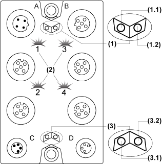

# Status LEDs

Status LEDs

The following figure shows the status LEDs of the TM7BAM4CLA block:

(1)   TM7 bus status LEDs, set of two LEDs: 1.1 (green) and 1.2 (red)

(2)   I/O status LEDs, composed of two sets of two LEDs: 1 and 2 (green), 3 and 4 (yellow)

(3)   I/O block status LEDs, set of two LEDs: 3.1 (green) and 3.2 (red)

The table below provides the TM7 bus status LEDs of the TM7BAM4VLA block:

| TM7 bus status LEDs | | Description |
| --- | --- | --- |
| LEDs 1.1 | LEDs 1.2 |
| OFF | OFF | No power supply on TM7 bus |
| ON | ON | TM7 bus in preoperational state:  opower supply on TM7 bus and  oblock not initialized |
| ON | OFF | TM7 bus in operational state |
| OFF | ON | TM7 bus error detected |

The table below provides the I/O status LEDs of the TM7BAM4VLA block:

| Channel LEDs | State | Description |
| --- | --- | --- |
| 1 and 2 | OFF | Open connection or sensor/actuator is disconnected |
| Flashing | Overflow or underflow of the input signal |
| ON | The analog/digital converter is running, a value is available |
| 3 and 4 | OFF | The enable relay is not closed yet, there is not any value available other than 0 |
| ON | The analog/digital converter is running, a value is available |

The table below provides the I/O block status LEDs of the TM7BAM4VLA block:

| Block status LEDs | State | Description |
| --- | --- | --- |
| 3.1 | OFF | No power supply |
| Single Flash | Reset state |
| Flashing | Preoperational state |
| ON | Operational state |
| 3.2 | OFF | OK or no power supply |
| Single Flash | Detected error for an I/O channel. Overflow or underflow of the input signal |
| Double Flash | Power supply not in the valid range |
| ON | Detected error or reset state |