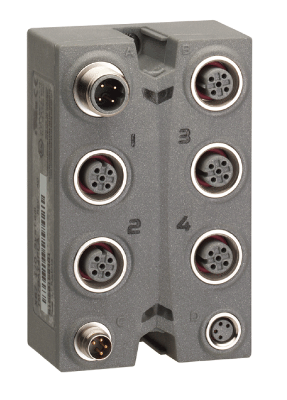

# TM7 Analog I/O Blocks - Hardware Guide

TM7 Analog I/O Blocks - Hardware Guide

TM7 Analog I/O Blocks - Hardware Guide

This manual describes the hardware implementation of the ModiconTM7 Analog I/O blocks. It provides parts descriptions, specifications, wiring diagrams, installation and setup for Modicon TM7 Analog I/O blocks.

EIO0000003245.01

© 2020 Schneider Electric. All rights reserved.