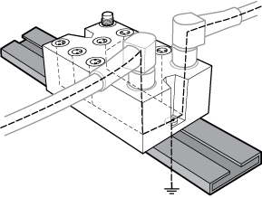

# Wiring Best Practices

Wiring Best Practices

Introduction

There are several rules that must be followed when wiring a TM7 System. Refer to [TM7 Cables](../../../../../../api/crossBook?lang=en-US&virtualBookName=m258pig&topicID=D_SE_0009890_1) for additional details.

Wiring Rules

|  |
| --- |
| DangerElectrical_Color.gifDanger_Color.gifDANGER |
| HAZARD OF ELECTRIC SHOCK, EXPLOSION OR ARC FLASH |
| oDisconnect all power from all equipment including connected devices prior to removing any covers or doors, or installing or removing any accessories, hardware, cables, or wires except under the specific conditions specified in the appropriate hardware guide for this equipment.  oAlways use a properly rated voltage sensing device to confirm the power is off where and when indicated.  oReplace and secure all covers, accessories, hardware, cables, and wires and confirm that a proper ground connection exists before applying power to the unit.  oUse only the specified voltage when operating this equipment and any associated products. |
| Failure to follow these instructions will result in death or serious injury. |

The following rules must be applied when wiring the TM7 System:

oI/O and communication wiring must be kept separate from the power wiring. Route these 2 types of wiring in separate cable ducting.

oVerify that the operating conditions and environment are within the specification values.

oUse proper wire sizes to meet voltage and current requirements.

oUse copper conductors only.

oUse only the [TM7 expansion bus cables](../../../../../../api/crossBook?lang=en-US&virtualBookName=m258pig&topicID=D_SE_0009660_1).

TM7 Blocks Grounding

The TM7 System blocks, when using Schneider Electric IP67 pre-fabricated cables, incorporate a grounding system intrinsic to the mounting and connecting hardware. The TM7 System blocks must always be mounted on a conductive backplane. The backplane or object used for mounting the blocks (metal machine frame, mounting rail or mounting plate) must be grounded (PE) according to your local, regional and national requirements and regulations. Refer to grounding of your [system blocks](../../../../../../api/crossBook?lang=en-US&virtualBookName=m258pig&topicID=D_SE_0002601_1), for more important information.

NOTE: If you do not use Schneider Electric IP67 pre-fabricated cables, you must use shielded cables and conductive connectors (metal threads on the connector), and be sure to connect the cable shield to the metal sleeve of the connector.

|  |
| --- |
| Warning_Color.gifWARNING |
| IMPROPER GROUNDING CONTINUITY |
| oUse only cables with insulated, shielded jackets.  oUse only IP67 connectors with metal threads.  oConnect the cable shield to the metal threads of the connectors.  oAlways comply with local, regional and/or national wiring requirements. |
| Failure to follow these instructions can result in death, serious injury, or equipment damage. |

The following figure presents the grounding of the TM7 System:

EIO0000003245.01

© 2020 Schneider Electric. All rights reserved.