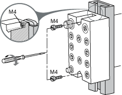
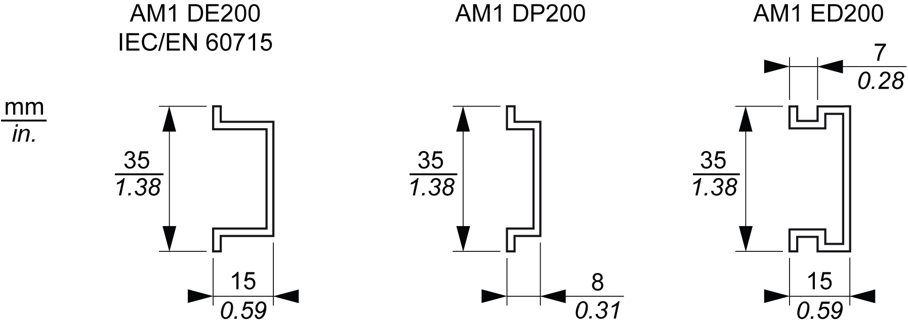
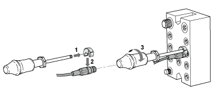
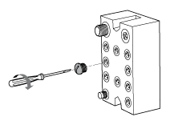

# Installation Guidelines

Installation Guidelines

Introduction

The TM7 System can be mounted using:

oAn aluminium frame with two wedge nuts and M4 screws

oA DIN rail with TM7ACMP mounting plate

oDirectly on the machine.

NOTE: Mounting on a DIN rail using the TM7ACMP mounting plate is only possible with the [size 1 (smallest) block dimension](../../../../../../api/crossBook?lang=en-US&virtualBookName=m258pig&topicID=D_SE_0015399_7).

NOTE: The TM7 System components must always be mounted to a conductive backplane.

TM7 Block on an Aluminium Frame

Blocks can be mounted on an aluminium frame with two wedge nuts and M4 screws:

NOTE: Maximum torque to fasten the M4 screws is  0.6 N.m (5.3 lbf-in).

|  |
| --- |
| NOTICE |
| INOPERABLE EQUIPMENT |
| oEnsure that the block is securely affixed to its mounting surface.  oDo not tighten screws beyond the specified maximum torque. |
| Failure to follow these instructions can result in equipment damage. |

TM7 Block on a DIN Rail

You can mount the size 1 blocks on a [DIN](../../../../../../api/crossBook?lang=en-US&virtualBookName=glossary/glossary.htm#XREF_D_SE_0024697_675) rail with the [TM7ACMP](../../../m258pig&topicID=D_SE_0009233_8) mounting plate. For EMC (Electromagnetic Compatibility) compliance, a metal DIN rail must be attached to a flat metal mounting surface or mounted on an EIA (Electronic Industries Alliance) rack or in a NEMA (National Electrical Manufacturers Association) enclosure. In all cases, the mounting surface must be [properly grounded](../../../../../../api/crossBook?lang=en-US&virtualBookName=m258pig&topicID=D_SE_0002601_1).

You can order a suitable DIN rail from Schneider Electric:

NOTE: Only size 1 (smallest) blocks can be installed on DIN rail with the mounting plate.

The following procedure gives step by step instructions to assemble and install a block on a DIN rail:

| Step | Action | |
| --- | --- | --- |
| 1 | Screw the block to the mounting plate. The required screws are supplied with the mounting plate.  NOTE: Maximum torque to fasten the required screws is  0.6 Nm (5.3 lbf-in). | G-SE-0008185.1.gif |
| 2 | Place the upper protruding catches of the mounting plate on the top edge of the DIN rail (1).  Rotate the block to the DIN rail until it clicks (2). | G-SE-0008186.1.gif |
| 3 | The block is correctly installed to the DIN rail | G-SE-0008184.1.gif |

|  |
| --- |
| NOTICE |
| INOPERABLE EQUIPMENT |
| oEnsure that the block is securely affixed to its mounting surface.  oDo not tighten screws beyond the specified maximum torque. |
| Failure to follow these instructions can result in equipment damage. |

For more information on mounting the DIN rail refer to the [TM5 section DIN Rail Installation](../../../../../../api/crossBook?lang=en-US&virtualBookName=m258pig&topicID=D_SE_0002436_1).

TM7 Block Directly on the Machine

The TM7 block can be mounted to any bare-metal surface of the machine, provided that the surface is [properly grounded](../../../../../../api/crossBook?lang=en-US&virtualBookName=m258pig&topicID=D_SE_0002601_1). To mount the block directly on the machine, the following figure gives the drilling template of the blocks:

(1)   Size 1 block

(2)   Size 2 block

The thickness of the base plate should be taken into consideration when defining the screw length.

NOTE: Maximum torque to fasten the required M4 screws is  0.6 Nm (5.3 lbf-in).

|  |
| --- |
| NOTICE |
| INOPERABLE EQUIPMENT |
| oEnsure that the block is securely affixed to its mounting surface.  oDo not tighten screws beyond the specified maximum torque. |
| Failure to follow these instructions can result in equipment damage. |

TM7 Cable Installation

The plug connector of the [TM7 cables](../../../../../../api/crossBook?lang=en-US&virtualBookName=m258pig&topicID=D_SE_0009890_1) is mounted by hand and then tightened to a defined force with the aid of the [torque wrench](../../../../../../api/crossBook?lang=en-US&virtualBookName=m258pig&topicID=D_SE_0009233_15):

| Connector Size | Torque |
| --- | --- |
| M8 | 0.2 Nm (1.8 lbf-in) |
| M12 | 0.4 Nm (3.5 lbf-in) |

|  |
| --- |
| Warning_Color.gifWARNING |
| IP67 NON-CONFORMANCE |
| oProperly fit all connectors with cables or sealing plugs and tighten for IP67 conformance according to the torque values as specified in this document.  oDo not connect or disconnect cables or sealing plugs in the presence of water or moisture. |
| Failure to follow these instructions can result in death, serious injury, or equipment damage. |

Sealing Plug Installation

Open connectors with no cable attached are capped with suitable [sealing plugs](../../../../../../api/crossBook?lang=en-US&virtualBookName=m258pig&topicID=D_SE_0009233_5):

| Connector Size | Torque |
| --- | --- |
| M8 | 0.2 Nm (1.8 lbf-in) |
| M12 | 0.4 Nm (3.5 lbf-in) |

|  |
| --- |
| Warning_Color.gifWARNING |
| IP67 NON-CONFORMANCE |
| oProperly fit all connectors with cables or sealing plugs and tighten for IP67 conformance according to the torque values as specified in this document.  oDo not connect or disconnect cables or sealing plugs in the presence of water or moisture. |
| Failure to follow these instructions can result in death, serious injury, or equipment damage. |

TM7 Block Labeling

The support for block label and its label are inserted in the appropriate opening in the top (the figure below) or in the bottom of the block:

1   Reference of the block

2   Area for customer

EIO0000003245.01

© 2020 Schneider Electric. All rights reserved.