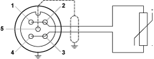
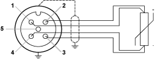

# TM7BAI4TLA Wiring Diagram

TM7BAI4TLA Wiring Diagram

Pin Assignments

The following figure shows the pin assignments for the input connectors of the TM7BAI4TLA block:

| Connection | Pin | M12 input |
| --- | --- | --- |
| G-SE-0006868.1.gif | 1 | Sensor + |
| 2 | Sense + |
| 3 | Sensor - |
| 4 | Sense - |
| 5 | Shield |

Wiring Considerations

|  |
| --- |
| Danger_Color.gifDANGER |
| FIRE HAZARD |
| Use cable sizes that meet the I/O channel and power supply voltage and current ratings. |
| Failure to follow these instructions will result in death or serious injury. |

If you do not properly wire the cable, you could introduce electromagnetic interference into the I/O block.

|  |
| --- |
| Warning_Color.gifWARNING |
| ELECTROMAGNETIC INTERFERENCE |
| oDo not connect cables to connectors that are not properly wired to the sensor or actuator.  oAlways use sealing plugs for any unused connectors. |
| Failure to follow these instructions can result in death, serious injury, or equipment damage. |

Use shielded, properly grounded cables for all analog and high-speed inputs or outputs and communication connections. If you do not use shielded cable for these connections, electromagnetic interference can cause signal degradation. Degraded signals can cause the controller or attached modules and equipment to perform in an unintended manner.

|  |
| --- |
| Warning_Color.gifWARNING |
| UNINTENDED EQUIPMENT OPERATION |
| oUse shielded cables for all fast I/O, analog I/O and communication signals.  oGround cable shields for all analog I/O, fast I/O and communication signals at a single point1.  oRoute communication and I/O cables separately from power cables. |
| Failure to follow these instructions can result in death, serious injury, or equipment damage. |

1Multipoint grounding is permissible if connections are made to an equipotential ground plane dimensioned to help avoid cable shield damage in the event of power system short-circuit currents.

|  |
| --- |
| Warning_Color.gifWARNING |
| IP67 NON-CONFORMANCE |
| oProperly fit all connectors with cables or sealing plugs and tighten for IP67 conformance according to the torque values as specified in this document.  oDo not connect or disconnect cables or sealing plugs in the presence of water or moisture. |
| Failure to follow these instructions can result in death, serious injury, or equipment damage. |

2 Wires Sensor Wiring

The following figure shows the 2 wires sensor and pin assignments for the input connectors of the TM7BAI4TLA block:

| Pin | Description |
| --- | --- |
| 1 | Sensor + (1) |
| 2 | Sense + (1) |
| 3 | Sensor - (2) |
| 4 | Sense - (2) |
| 5 | Shield |
| The following M12 connector pins must be bridged together:  o1: Pins 1 and 2  o2: Pins 3 and 4 | |

4 Wires Sensor Wiring

The following figure shows the 4 wires sensor and pin assignments for the input connectors of the TM7BAI4TLA block:

| Pin | Description | Color (1) |
| --- | --- | --- |
| 1 | Sensor + | Brown |
| 2 | Sense + | White |
| 3 | Sensor - | Black |
| 4 | Sense - | Blue |
| 5 | Shield | – |
| 1   The colors used are specific to Schneider Electric. | | |

For further information, refer to [cable references](../../../../../../api/crossBook?lang=en-US&virtualBookName=m258pig&topicID=D_SE_0009909_5)

|  |
| --- |
| Caution_Color.gifCAUTION |
| INOPERABLE EQUIPMENT |
| Wire the sensor power supply positive pole to the sensor input positive pole and the sensor power supply negative pole to the sensor input negative pole within the connector. |
| Failure to follow these instructions can result in injury or equipment damage. |

EIO0000003245.01

© 2020 Schneider Electric. All rights reserved.