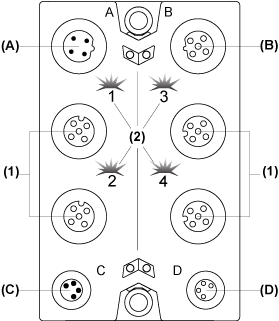

# TM7BAI4PLA Presentation

TM7BAI4PLA Presentation

Main Characteristics

The table below provides the main characteristics of the TM7BAI4PLA block:

| Main characteristics | | |
| --- | --- | --- |
| Number of input channels | 4 | |
| Measurement type | Temperature | |
| Input sensor type | J, K and S thermocouple sensors | |
| Resolution | 16 bits | |
| Sensor connection type | M12, [A coded](../glossary/glossary.htm#XREF_D_SE_0024697_619), female [connector type](TM7BAI4xLA_Analog_Temp_Input_Module-9.htm#XREF_D_SE_0008035_4) | |

The thermocouple blocks are configured as a whole for the same type of thermocouple sensor. You cannot mix thermocouple sensor types on the same block, otherwise the temperature readings will not be correct.

|  |
| --- |
| Warning_Color.gifWARNING |
| UNINTENDED EQUIPMENT OPERATION |
| oOnly connect thermocouple sensors of the same type to the temperature block.  oConfigure the block for the correct type of thermocouple. |
| Failure to follow these instructions can result in death, serious injury, or equipment damage. |

Description

The following figure shows the TM7BAI4PLA block:

(A)   TM7 bus IN connector

(B)   TM7 bus OUT connector

(C)   24 Vdc power IN connector

(D)   24 Vdc power OUT connector

(1)   Input connectors

(2)   Status LEDs

Connector and Channel Assignments

The table below provides the connector and channel assignments of the TM7BAI4PLA block:

| Input connectors | Input status LEDs | Channel type | Channels |
| --- | --- | --- | --- |
| 1 | 1 | Input | I0 |
| 2 | 2 | Input | I1 |
| 3 | 3 | Input | I2 |
| 4 | 4 | Input | I3 |

Status LEDs

The following figure shows the status LEDs of the TM7BAI4PLA block:

(1)   TM7 bus status LEDs, set of two LEDs: 1.1 (green) and 1.2 (red)

(2)   Input status LEDs, composed of four LEDs: 1, 2, 3 and 4 (green)

(3)   Input block status LEDs, set of two LEDs: 3.1 (green) and 3.2 (red)

The table below provides the TM7 bus status LEDs of the TM7BAI4PLA block:

| TM7 bus status LEDs | | Description |
| --- | --- | --- |
| LED 1.1 | LED 1.2 |
| OFF | OFF | No power supply on TM7 bus |
| ON | ON | TM7 bus in preoperational state:  opower supply on TM7 bus and  oblock not initialized |
| ON | OFF | TM7 bus in operational state |
| OFF | ON | TM7 bus error detected |

The table below provides the input status LEDs of the TM7BAI4PLA block:

| Channel LEDs | State | Description |
| --- | --- | --- |
| 1 - 4 | OFF | Open connection or sensor is disconnected or not used |
| Flashing | Overflow or underflow of the input signal |
| ON | The analog/digital converter is running, a value is available |

The table below provides the input block status LEDs of the TM7BAI4PLA block:

| Block Status LEDs | State | Description |
| --- | --- | --- |
| 3.1 | OFF | No power supply |
| Single Flash | Reset state |
| Flashing | Preoperational state |
| ON | Operational state |
| 3.2 | OFF | OK or no power supply |
| Single Flash | Detected error for an input channel. Overflow or underflow of the input signal |
| Double Flash | Power supply not in the valid range |
| ON | Detected error or reset state |

Terminal Temperature (Cold Junction) Compensation

When using thermocouples, it is necessary to measure the temperature at the terminal connections of the TM7BAI4PLA in order to calculate an accurate absolute temperature at the measuring point of the thermocouple. The sensor used to measure the terminal temperature is integrated in the TM7ACTHA thermocouple connector.

NOTE: At least one terminal temperature sensor TM7ACTHA is required to determine the temperature measured by the connected thermocouples. Otherwise, a value of 7FFF hex is calculated for all the connected thermocouples.

The accuracy of the temperature measurement of the connected thermocouples is a function of the number of terminal temperature sensors connected to the block.

The table below provides examples for the possible configurations:

| TM7ACTHA connected on the input connector | Description |
| --- | --- |
| 1 | The terminal temperature compensation for all 4 channels is performed using the temperature measured on connector 1. |
| 1 and 3 | The terminal temperature compensation for channels I0 and I1 is performed using the temperature measured on connector 1. The terminal temperature compensation for channels I2 and I3 is performed using the temperature measured on connector 3. |
| 1, 2, 3 and 4 | The terminal temperature compensation is performed using the temperature measured on the respective connector. |
| NOTE: For the correspondence between the connectors and channels, refer to [Connector and Channel Assignments](#XREF_D_SE_0008033_10). | |

TM7ACTHA Presentation

The TM7ACTHA thermocouple plug is used for compensation of the temperature at measurements points. The sensor to measure the terminal temperature is integrated in the thermocouple plug.

The following figure shows the TM7ACTHA:

See also TM7ACTHA [Characteristics](TM7BAI4xLA_Analog_Temp_Input_Module-8.htm#XREF_D_SE_0008034_6) and Wiring.

EIO0000003245.01

© 2020 Schneider Electric. All rights reserved.