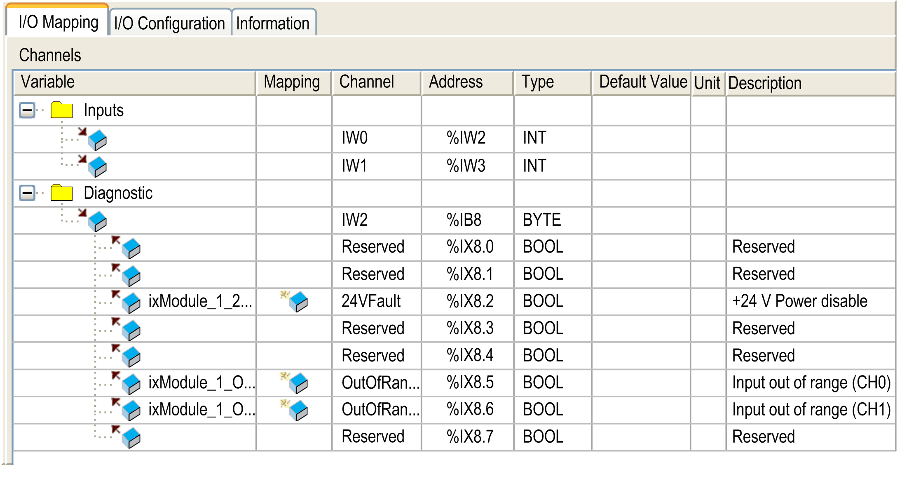

# Configuring Cartridges

## I/O Configuration

The configuration of a cartridge is carried out through the I/O Mapping and I/O Configuration tabs of the cartridge module.

To display the configuration tabs:

| Step | Action |
| --- | --- |
| 1 | In the Devices tree, double-click the cartridge. The I/O Mapping tab appears. |
| 2 | Edit the parameters of the I/O Mapping tab to configure the addresses used by the cartridge module and diagnostic information. |
| 3 | Click the I/O Configuration tab to configure the cartridge. For details on the I/O Configuration tab, refer to the description of individual modules. |

## I/O Mapping Tab Description

The I/O Mapping tab allows you to:

* Map input and output channels onto variables.
* View diagnostic information relating to the status of the cartridge.

This figure shows an example of the I/O Mapping tab:

## I/O Mapping for Inputs/Outputs

This table describes each parameter of the I/O Mapping tab for inputs and outputs:

| Parameter | Description |
| --- | --- |
| Variable | Allows you to map the channel on a variable.  NOTE: Expand the list of variables from the category Inputs or Outputs.  You can map a channel by either creating a new variable or mapping to an existing variable.  Create new variable:  Double-click the variable to enter the new variable name. A new variable is created if the variable does not already exist.  Map to existing variable:  Double-click the variable and click [...] to open the Input Assistant window. Select the variable from the list and press OK.  This figure shows the Input Assistant window: |
| Mapping | Indicates whether the channel is mapped on a new variable or an existing variable. |
| Channel | Displays the channel name of the device. |
| Address | Displays the address of the channel.  NOTE: If the channel is mapped to an existing variable, the corresponding address appears as strikethrough text in the table. |
| Type | Displays the data type of the channel. |
| Default Value | Indicates the value taken by the output when the controller is in a STOPPED or HALT state.  Double-click the cell to change the default value. |
| Unit | Displays the unit of the channel value. |
| Description | Allows you to enter a short description of the channel. |

EIO0000003107.01