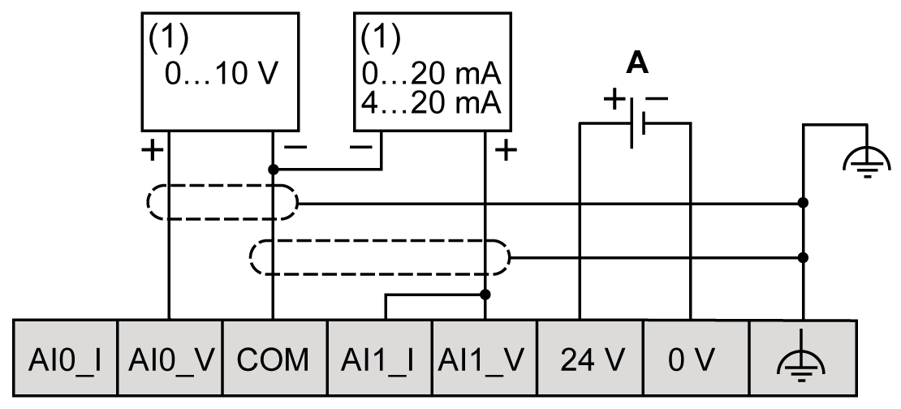

# TMC4AI2 Wiring Diagram

## Introduction

This cartridge has a removable spring terminal block for the connection of the inputs.

## Wiring Rules

See [Wiring Best Practices](D-SE-0036672.html#D-SE-0036672).

## Wiring Diagram

The following figure shows an example of the voltage and current input connection:

**(1):** Current/Voltage analog output device

**A:** External power supply

NOTE: Each input can be connected to either a voltage or current input.

EIO0000003113.02