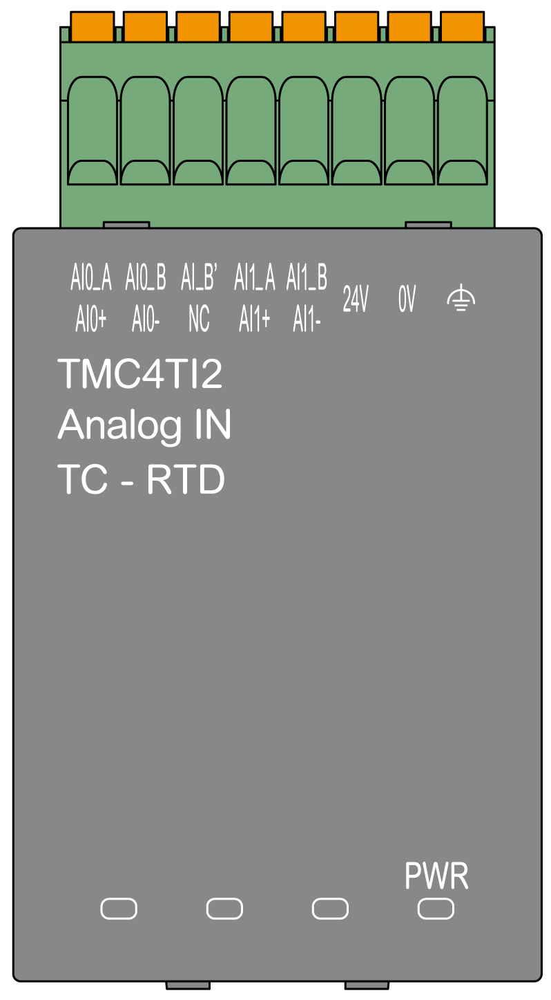

# TMC4TI2 Presentation

## Overview

The following features are integrated into the TMC4TI2 cartridge:

* 2 analog temperature inputs (thermocouple or RTD)
* removable spring terminal block, 3.5 mm (0.14 in.) pitch

## Main Characteristics

| Characteristics | | Value | |
| --- | --- | --- | --- |
| Thermocouple | RTD |
| Number of input channels | | 2 | |
| Input range | | Type K, J, R, S, B, E, T, N | Type Pt100, Pt1000, Ni100, Ni1000 |
| Resolution | | 14 bits (16384 steps) | |
| Connection type | | 3.5 mm (0.14 in.) pitch, removable spring terminal block | |
| Weight | | 55 g (1.94 oz) | |

## Power LED

The following diagram shows a TMC4TI2 cartridge with its power LED labeled **PWR**:

| LED | Color | Status | Description |
| --- | --- | --- | --- |
| **PWR** | Green | On | The cartridge is powered by the logic controller and the external power supply (24 Vdc) is applied. |
| Flashing | The cartridge is powered by the logic controller but the external power supply (24 Vdc) is not applied. |
| Off | The cartridge is not powered by the logic controller. |

EIO0000003113.02