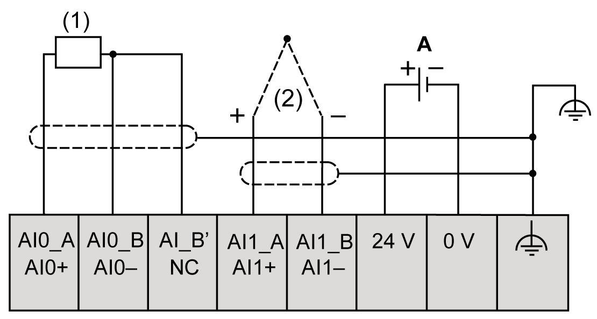
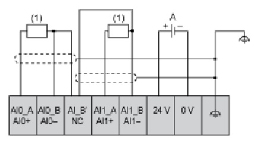
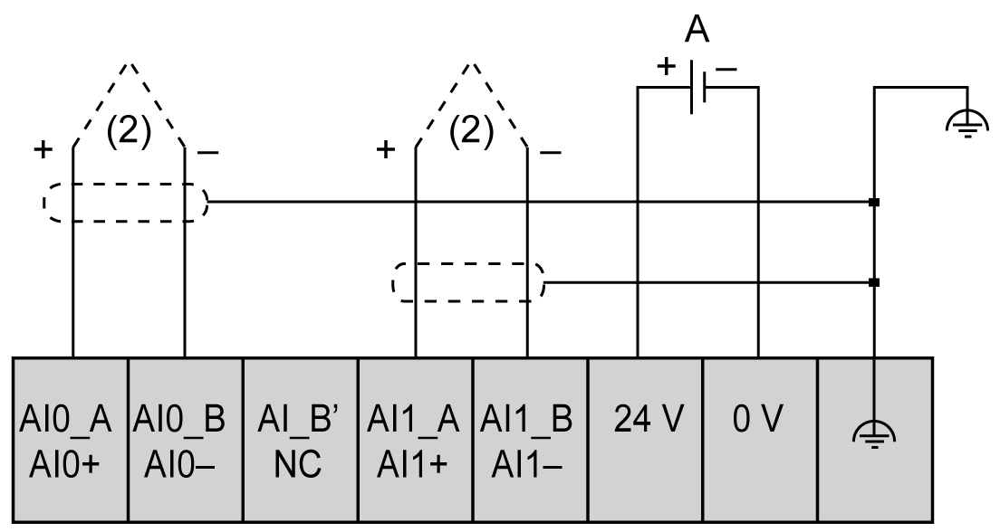
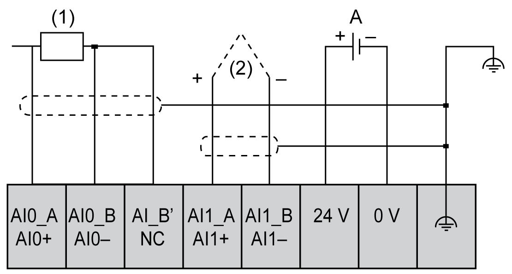

# TMC4TI2 Wiring Diagram

## Introduction

This cartridge has a removable spring terminal block for the connection of the inputs.

## Wiring Rules

See [Wiring Best Practices](D-SE-0036672.html#D-SE-0036672).

## Wiring Diagram

The following figure shows an example of 3-wire RTD and thermocouple probe connections:

**(1):** RTD

**(2):** Thermocouple

**A:** External power supply

The following figure shows an example of a pair of 3-wire RTD connections:

**(1):** RTD

**A:** External power supply

The following figure shows an example of a pair of thermocouple connections:

**(2):** Thermocouple

**A:** External power supply

The following figure shows an example of 4-wire RTD and thermocouple connections:

**(1):** RTD

**(2):** Thermocouple

**A:** External power supply

NOTE: Each input can be connected to either an RTD or thermocouple probe.

| WARNING | |
| --- | --- |
|  | UNINTENDED EQUIPMENT OPERATION  Do not connect wires to unused terminals and/or terminals indicated as “No Connection (N.C.)”.  Failure to follow these instructions can result in death, serious injury, or equipment damage. |

EIO0000003113.02