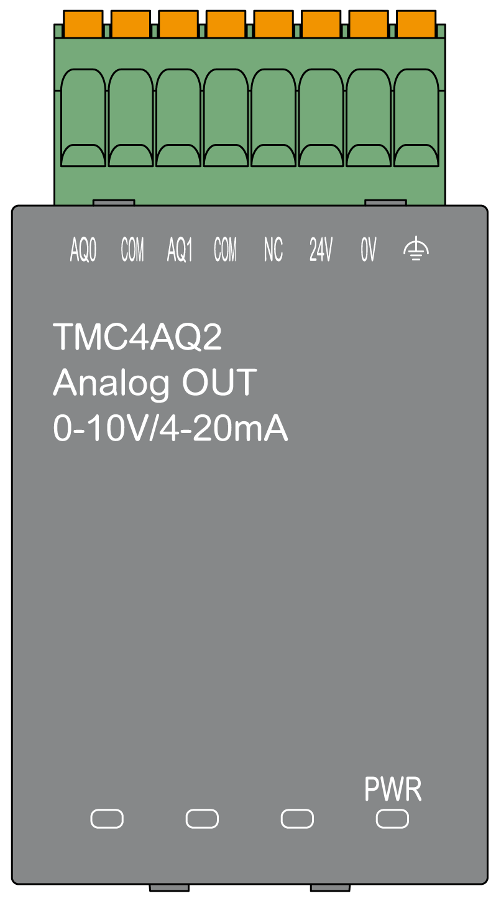

# TMC4AQ2 Characteristics

## Introduction

This section provides a general description of the TMC4AQ2 cartridge characteristics.

See also [Environmental Characteristics](D-SE-0025088.html).

| WARNING | |
| --- | --- |
|  | UNINTENDED EQUIPMENT OPERATION  Do not exceed any of the rated values specified in the environmental and electrical characteristics tables.  Failure to follow these instructions can result in death, serious injury, or equipment damage. |

## Connectors

The following diagram shows a TMC4AQ2 cartridge marking and connectors:

## Output Characteristics

The following table describes the cartridge output characteristics:

| Characteristics | | Value | |
| --- | --- | --- | --- |
| Voltage output | Current output |
| Rated output range | | 0...10 Vdc | 4...20 mA |
| Load impedance | | > 2 KΩ | < 500 Ω |
| Application load type | | Resistive load | |
| Settling time | | 10 ms | |
| Total output system transfer time | | 10 ms + 1 scan time | |
| Maximum accuracy at ambient temperature without EMC disturbance: 25 °C (77 °F) | | ± 0.2 % of full scale | |
| Temperature drift | | ± 0.006 % of full scale per 1 °C (1.8 °F) | |
| Repeatability after stabilization time | | ± 0.5 % of full scale | |
| Non-linearity | | ± 0.05 % of full scale | |
| Output ripple | | ± 20 mV | |
| Output voltage drop | | 1 % | |
| Overshoot | | 0 % | |
| Maximum output deviation | | ± 0.5 % of full scale | |
| Digital resolution | | 16 bits (65536 steps) | |
| Output value of LSB | | 0.153 mV | 0.305 μA |
| Data type in application program | | 0...4095 | |
| Noise resistance | Maximum temporary deviation during perturbations | ± 2 % of full scale | |
| Cable type and maximum length | Shielded | |
| < 30 m (98.4 ft) | |
| External crosstalk (minimum) | 80 dB | |
| 50/60 Hz common-mode rejection ratio (minimum) | 90 dB | |
| Isolation | Isolation between outputs and internal logic | 500 Vdc | |
| Isolation between outputs | Not isolated | |
| Output protection | | Short circuit protection | Open circuit protection |
| Behavior when internal power supply level is lower than threshold | | Outputs are set to 0 | |
| Behavior when external power is not applied | | **PWR** LED flashing | |
| External power supply | Supply voltage | 24 Vdc ± 15 % | |
| Power consumption | 2 W | |

EIO0000003113.02