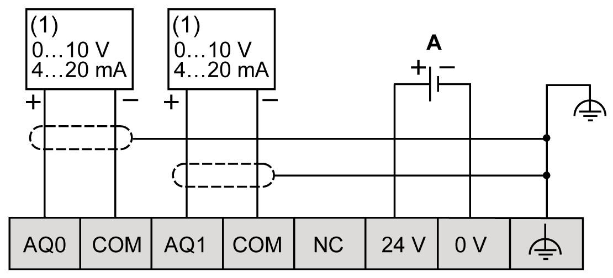

# TMC4AQ2 Wiring Diagram

## Introduction

This cartridge has a removable spring terminal block for the connection of the outputs.

## Wiring Rules

See [Wiring Best Practices](D-SE-0036672.html#D-SE-0036672).

## Wiring Diagram

The following figure shows an example of the voltage and current outputs connection:

**(1):** Current/Voltage analog input device

**A:** External power supply

NOTE: Each output can be connected either as a voltage or current output.

| WARNING | |
| --- | --- |
|  | UNINTENDED EQUIPMENT OPERATION  Do not connect wires to unused terminals and/or terminals indicated as “No Connection (N.C.)”.  Failure to follow these instructions can result in death, serious injury, or equipment damage. |

EIO0000003113.02