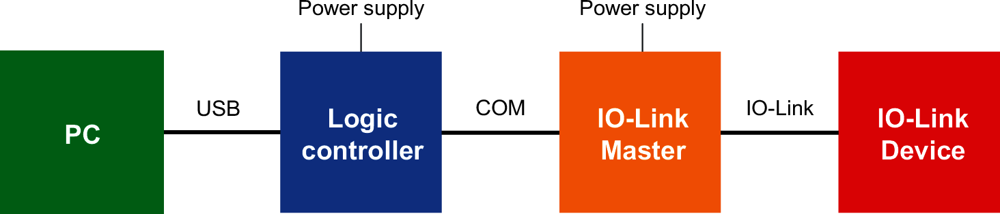
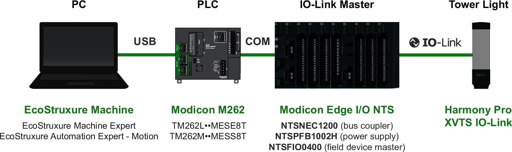

# Architecture Description

## IO-Link Standard Architecture

The architecture of IO-Link systems is built according to the following principle:

IO-Link devices can only be operated and configured using an IO-Link Master.

## Smart Tower Light Architecture

The Smart Tower Light Architecture is a Schneider Electric products system which allows you to use your XVTS IO-Link tower lights:

This IO-Link tower light environment is composed of:

**PC commissioning tool**

* A computer with EcoStruxureTM Machine Expert or EcoStruxureTM Automation Expert - Motion softwares installed (Modicon Edge I/O NTS – Web Interface can be used as an alternative),
* Or any third-party IO-Link software (open source or proprietary).

**PLC in operation**

* Modicon M262 logic/motion controller (TM262M••MESS8T or TM262L••MESE8T),
* Or any third-party PLC.

**IO-Link Master**

* Modicon Edge I/O NTS (as IO-Link Master), with the following modules:

  + NTSNEC1200 (bus coupler),
  + NTSPFB1002H (power supply),
  + NTSFIO0400 (field device master).
* Or any third-party IO-Link Master.

**Harmony Pro XVTS tower lights**

EIO0000005746.00