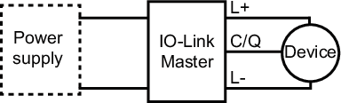
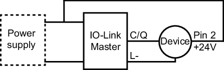
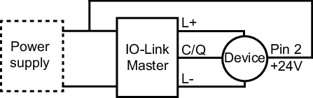

# IO-Link Standard Wiring

The default factory setting sets the power reduction to 1 (ON).  
This power reduction is an IO-Link parameter used to limit the current consumption from the IO-Link Master during the initial set up. With this parameter, the current consumption is limited to a maximum of 200 mA. The wiring is as follows:

If this power reduction is set to 0 (OFF), current consumption exceeds 200 mA. Some IO-Link Masters require an external auxiliary voltage supply on Pin 2 (+24 V). The proposed wiring are:

**OR**

EIO0000005746.00