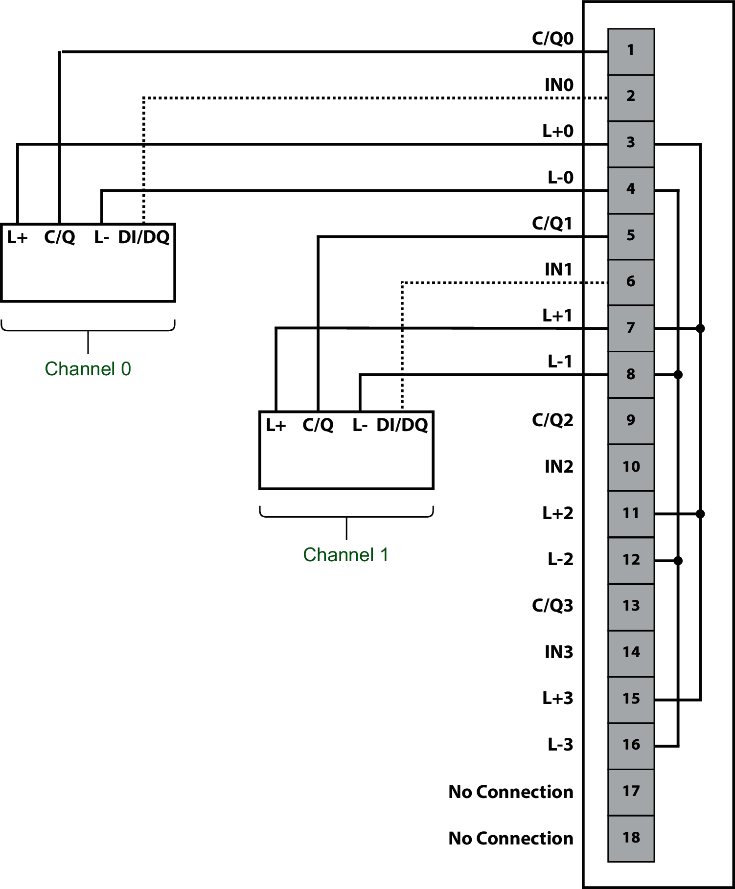

# NTSFIO0400 IO-Link Master

With NTSFIO0400 IO-Link Master, XVTS tower lights have to be connected to channels 0 and 1 only.

You have to use wiring compatible with the current restriction of the devices:

|  |  |  |  |  |
| --- | --- | --- | --- | --- |
| **NTSFIO0400**  Max. current limitation of the L+ supply | | **XVTS tower lights**  Current consumption | | **Wiring** |
| Channels | Current | Pwr reduction ON | Pwr reduction OFF |
| 0 and 1 | 250 mA | 200 mA | > 200 mA | Possible |
| 2 and 3 | 200 mA | 200 mA | > 200 mA | Avoid |

The following figure illustrates the wiring of the IO-Link device (class A):

| WARNING | |
| --- | --- |
|  | UNINTENDED EQUIPMENT OPERATION  Do not connect wires to unused terminals and/or terminals indicated as “No Connection (N/C)”.  Failure to follow these instructions can result in death, serious injury, or equipment damage. |

EIO0000005746.00